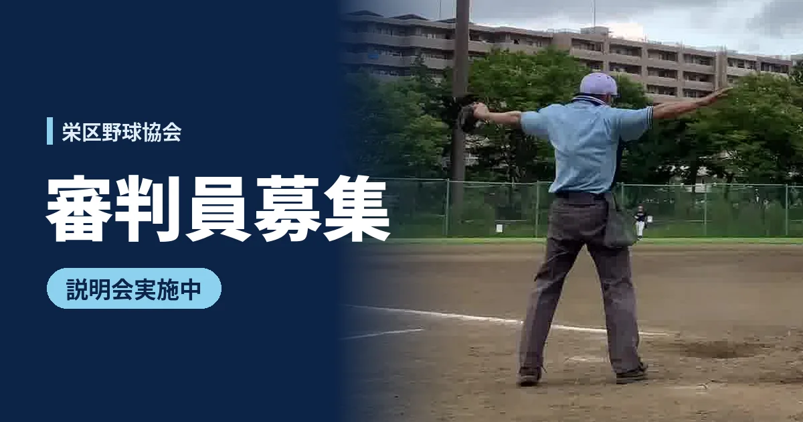

栄区民野球大会を一緒に支えてくれる審判員を募集しています。
まずは説明会に気軽に来てください。

::: tip 説明会（2026年9月〜12月）
- **時間**：各日 10:00〜11:00
- **場所**：金井公園野球場
- **服装**：自由
:::

## 説明会の日程

- 9月20日（日）
- 9月26日（土）
- 10月12日（月・祝）※俣野公園・横浜薬大スタジアム
- 10月18日（日）
- 11月1日（日）
- 11月15日（日）
- 11月23日（月・祝）
- 12月13日（日）

## こんな方を歓迎します

- 16歳以上
- 未経験者・経験者問いません
- 月1回以上、栄区民野球大会(金井公園中心)での審判活動に参加できる方

## お問い合わせ

説明会への参加希望や質問は [問い合わせフォーム](https://www.sakae-baseball.org/form.php) からどうぞ。

<iframe width="560" height="315" src="https://www.youtube.com/embed/IoGi_DrYDZ8?si=Cxpl4g8K8wei6HoU" title="YouTube video player" frameborder="0" allow="accelerometer; autoplay; clipboard-write; encrypted-media; gyroscope; picture-in-picture; web-share" referrerpolicy="strict-origin-when-cross-origin" allowfullscreen></iframe>
