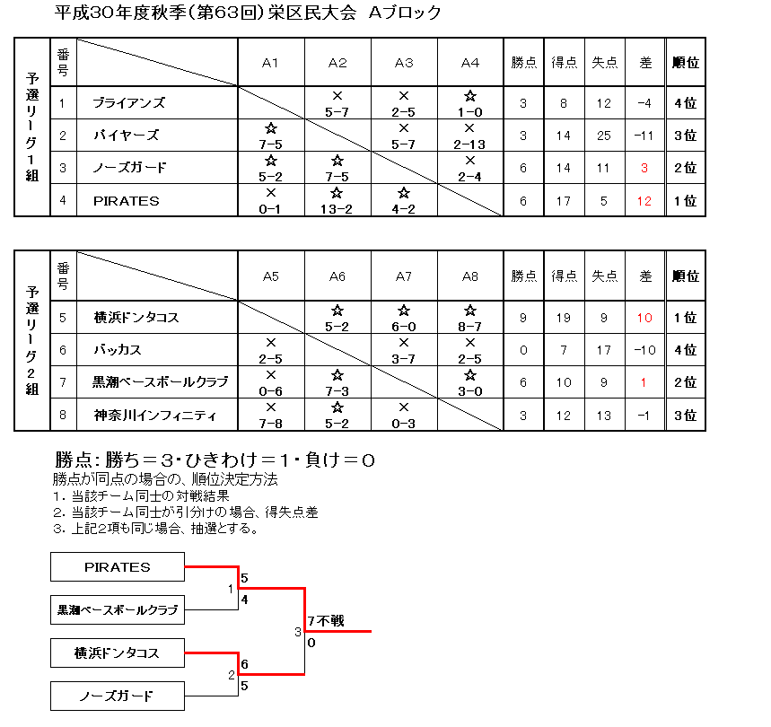
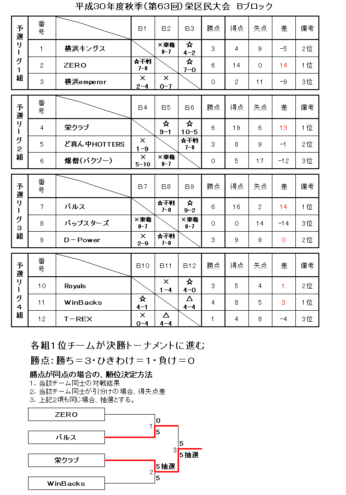
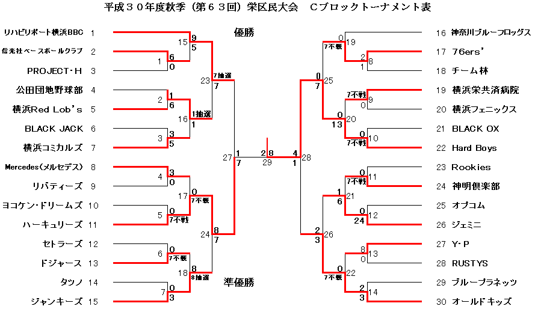
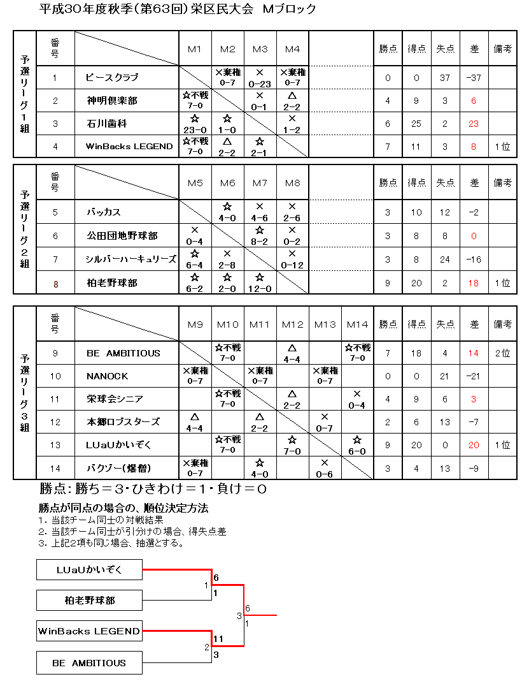

# 第63回大会

## Aブロック

最優秀選手 ＰＩＲＡＴＥＳ　鈴木邑基選手（写真左）
優秀選手　横浜ドンタコス　今井猛生選手（写真右）

## Bブロック

最優秀選手 栄クラブ　今井清尚選手(写真右)
優秀選手　バルス　渋谷秀則選手（写真左)

## Cブロック

最優秀選手 Ｈａｒｄ　Ｂｏｙｓ　深野留衣選手（写真右）
優秀選手　ハーキュリーズ　山岡秀司選手（写真左）

## Mブロック

最優秀選手 ＬＵａＵかいぞく　 浅羽賢一選手（写真右）
優秀選手 ＷｉｎＢａｃｋｓ　ＬＥＧＥＮＤ　川崎周一選手（写真左）

