# 第57回 栄区民野球大会

## Aブロック

- 優勝 バッカス
- 準優勝 ブライアンズ

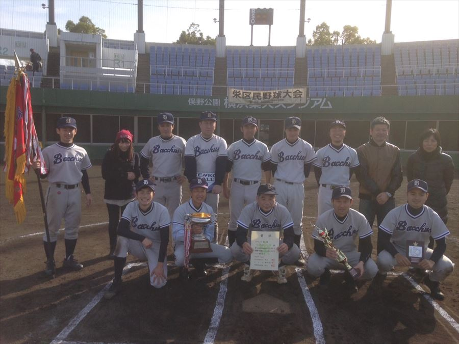

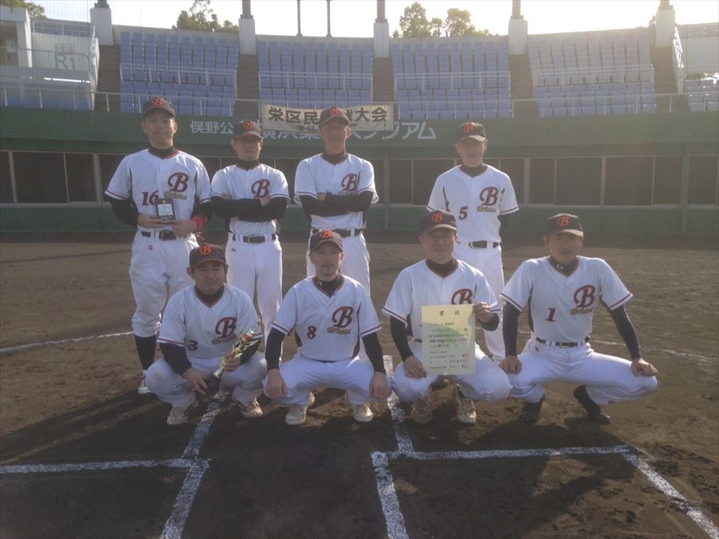

- 最優秀選手 バッカス　清田選手
- 優秀選手 ブライアンズ　村山選手

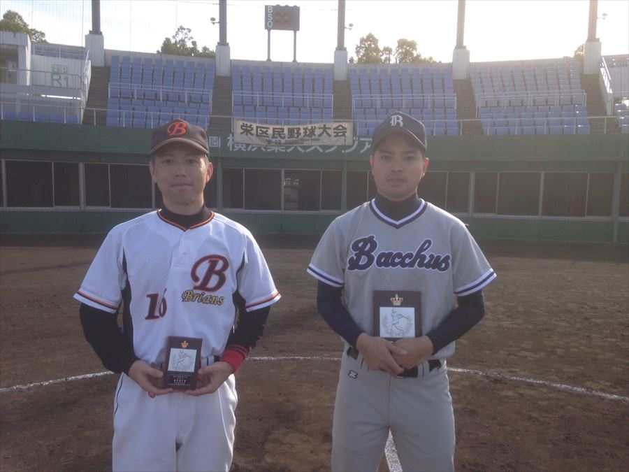

## Bブロック

- 優勝 神奈川インフィニティ
- 準優勝 黒潮ベースボールクラブ

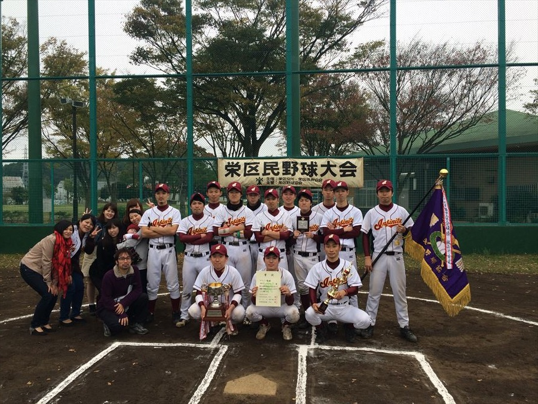

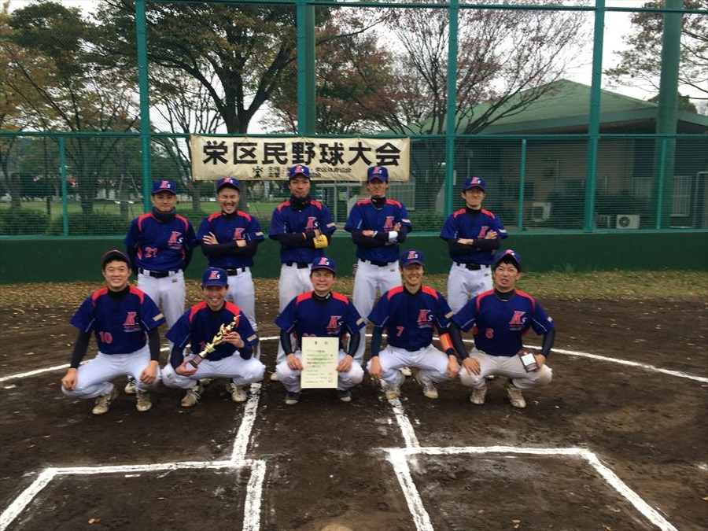

- 最優秀選手 神奈川インフィニティ　堀田選手
- 優秀選手 黒潮ベースボールクラブ　森口選手

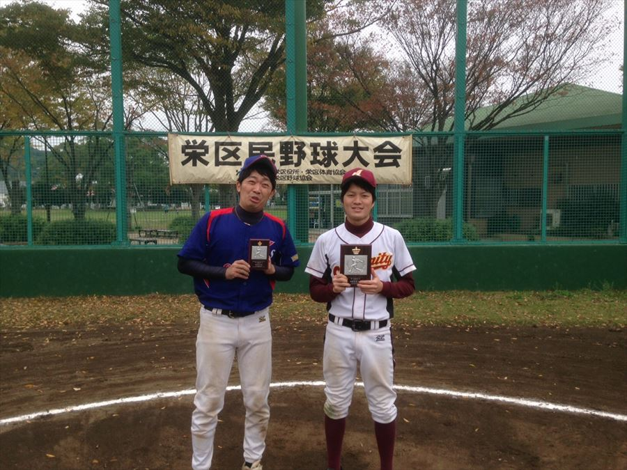

## Cブロック

- 優勝 横浜ブルージェイズ
- 準優勝 オールドキッズ

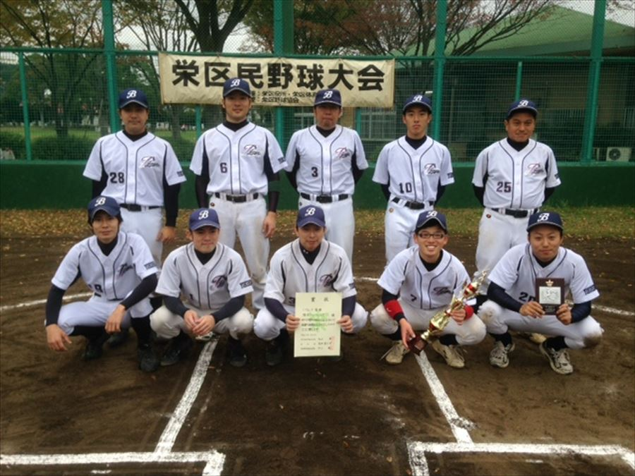

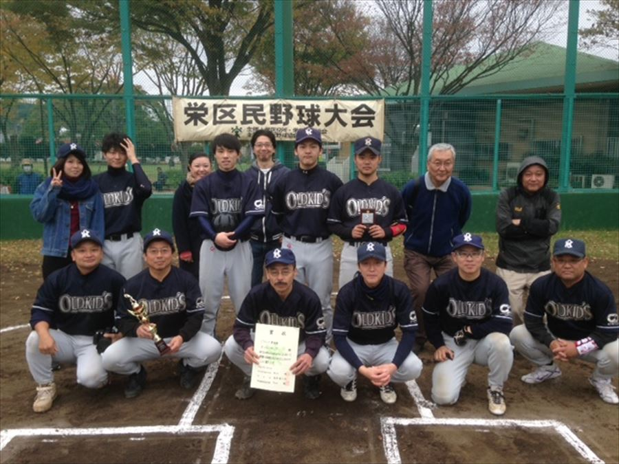

- 最優秀選手 横浜ブルージェイズ　山本選手
- 優秀選手 オールドキッズ　大坂（勇）選手

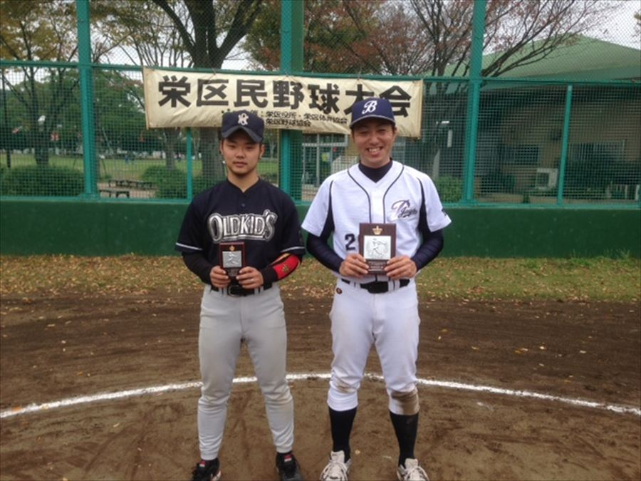

## Mブロック

- 優勝 ＬＵａＵかいぞく
- 準優勝 WinBacks LEGEND

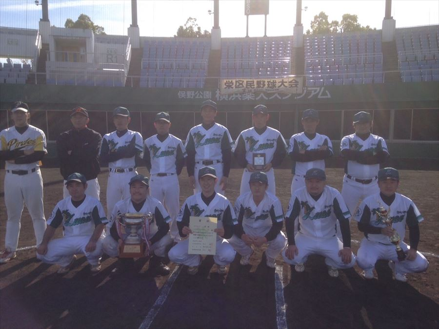

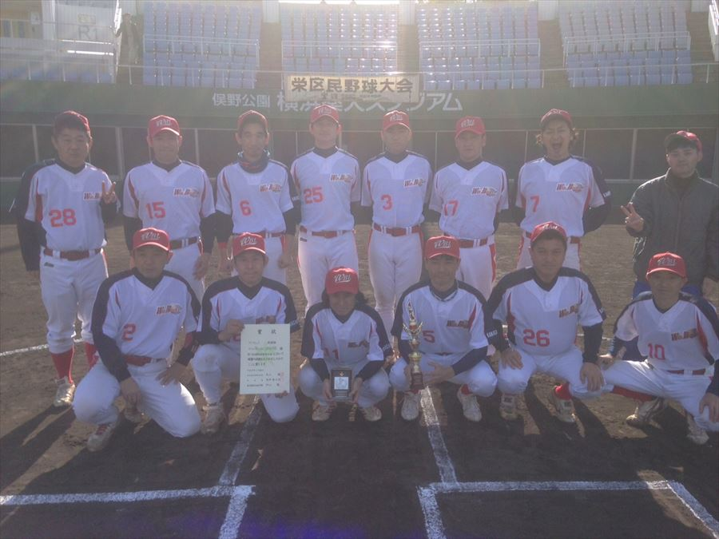

- 最優秀選手 ＬＵａＵかいぞく　杉本選手
- 優秀選手 ＷｉｎＢａｃｋｓ　ＬＥＧＥＮＤ　三石選手

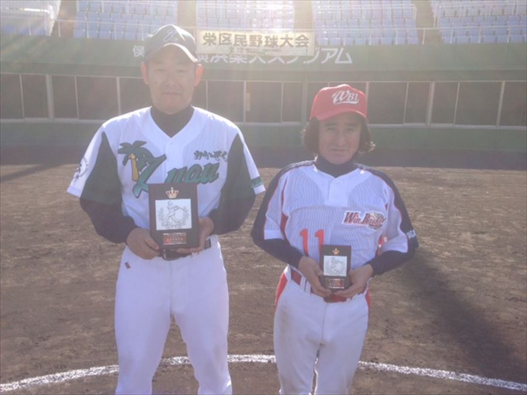
