# 第60回 栄区民野球大会

## Aブロック

- 優勝 ブライアンズ
- 準優勝 ＰＩＲＡＴＥＳ

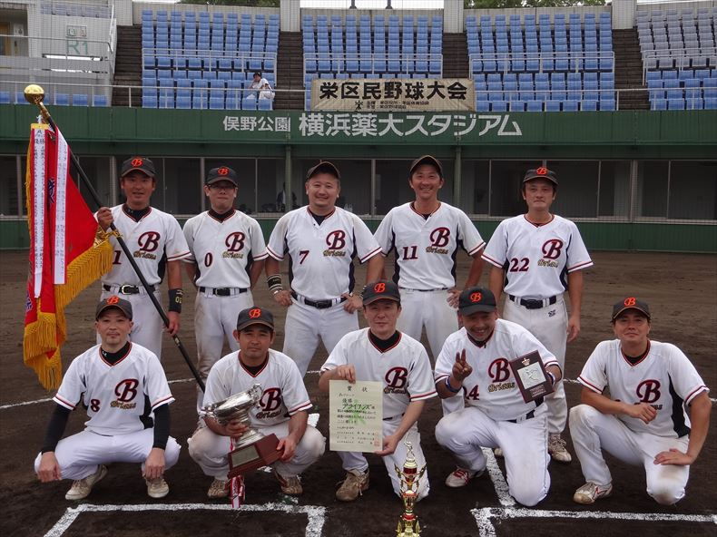

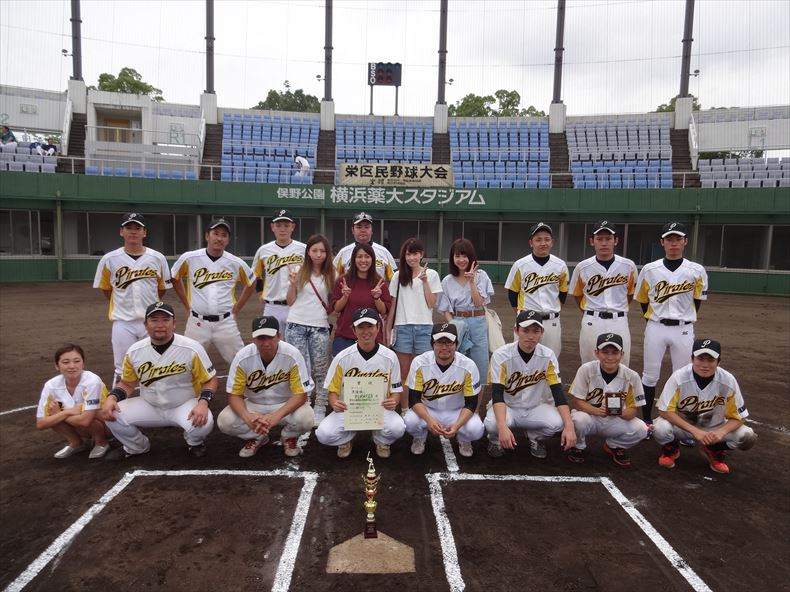

- 最優秀選手 ブライアンズ　小林良介選手
- 優秀選手 ＰＩＲＡＴＥＳ　菊地恭平選手

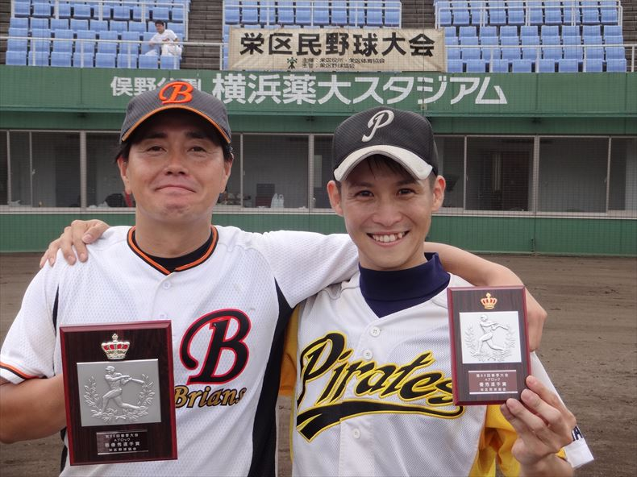

## Bブロック

- 優勝 ノーズガード
- 準優勝 バルス

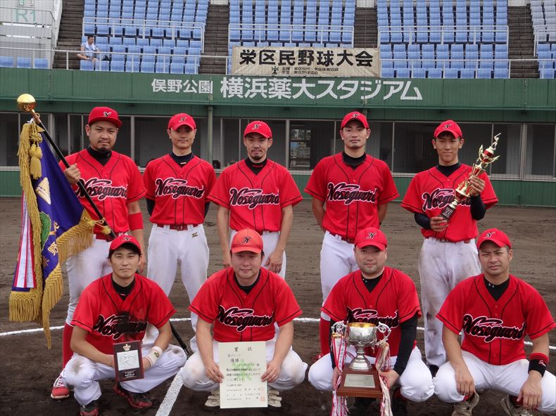

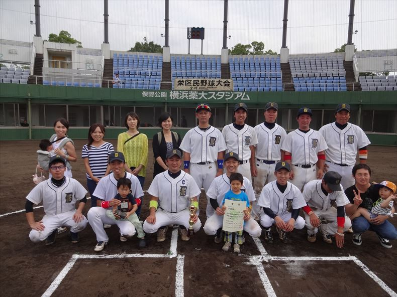

- 最優秀選手 ノーズガード　廣川賢一選手
- 優秀選手 バルス　中澤秀幸選手

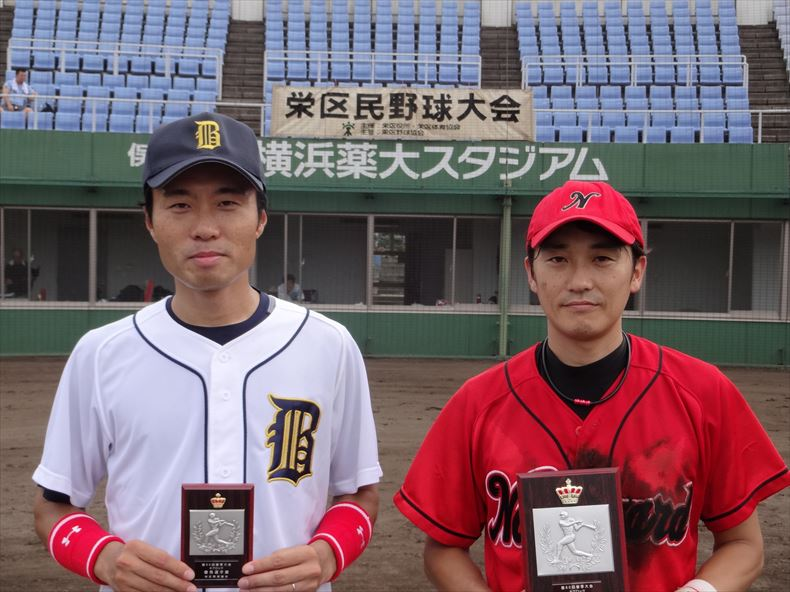

## Cブロック

- 優勝 ロイヤルズ
- 準優勝 神奈川ブルーフロッグス

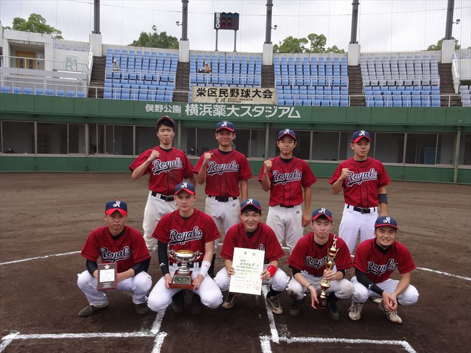

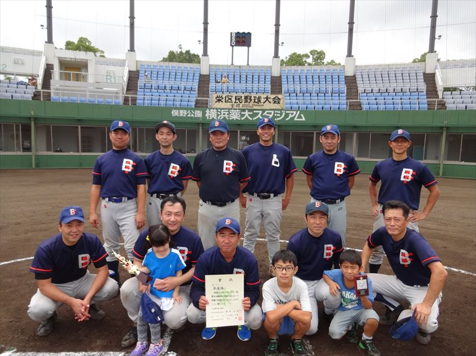

- 最優秀選手 ロイヤルズ　山本翔選手
- 優秀選手 神奈川ブルーフロッグス　佐藤天則選手

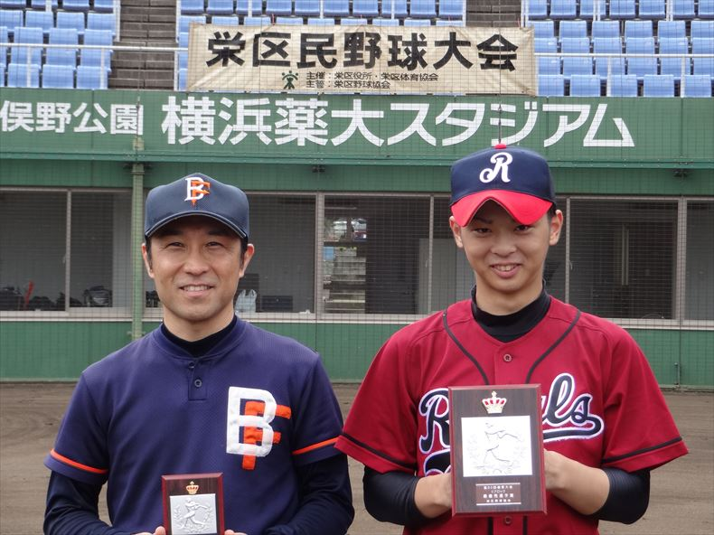

## Mブロック

- 優勝 ＬＵａＵかいぞく
- 準優勝 石川歯科

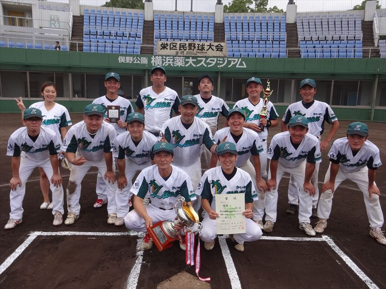

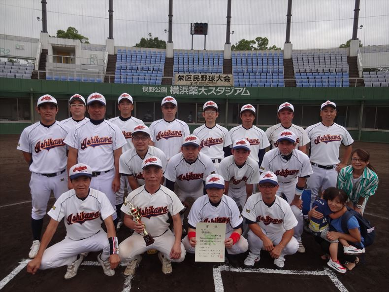

- 最優秀選手 ＬＵａＵかいぞく　青柳大輔選手
- 優秀選手 石川歯科　小林秀行選手

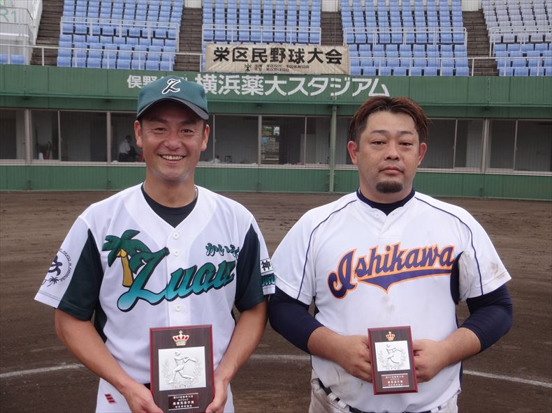
