# 第61回 栄区民野球大会

## Aブロック

- 優勝 横浜ドンタコス
- 準優勝 ブライアンズ

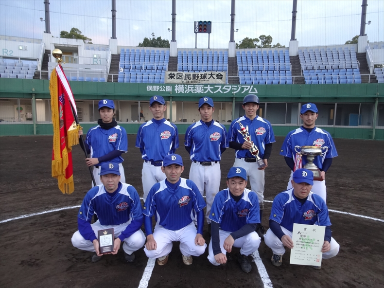

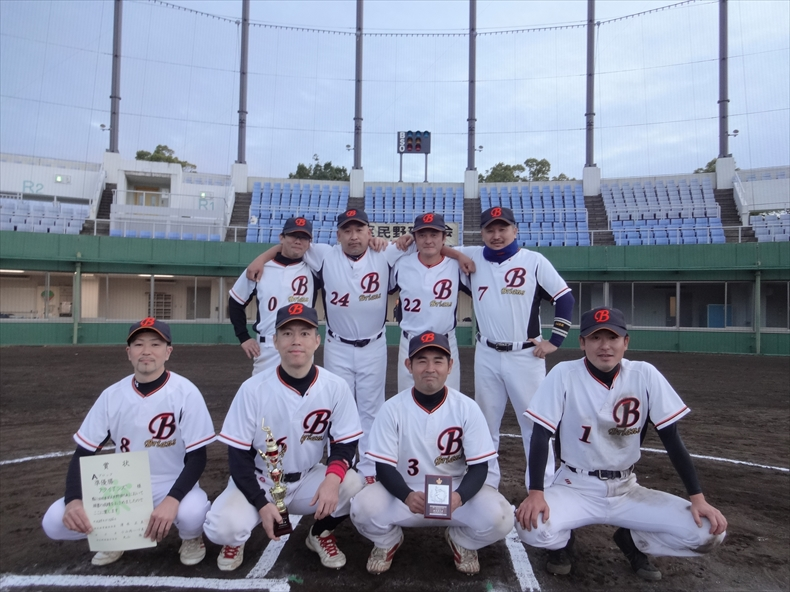

- 最優秀選手 横浜ドンタコス　今井猛生選手
- 優秀選手 ブライアンズ　長尾雅也選手

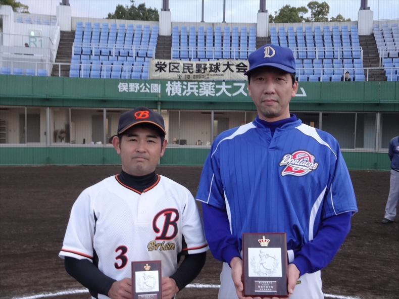

## Bブロック

- 優勝 ロイヤルズ
- 準優勝 パイヤーズ

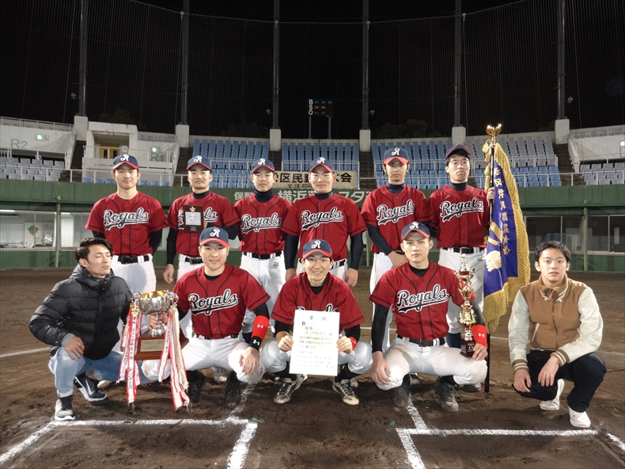

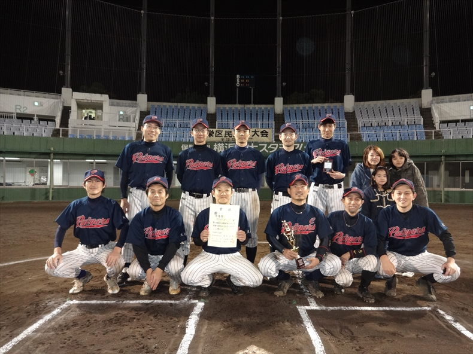

- 最優秀選手 ロイヤルズ　野崎修平選手
- 優秀選手 パイヤーズ　足立翔真選手

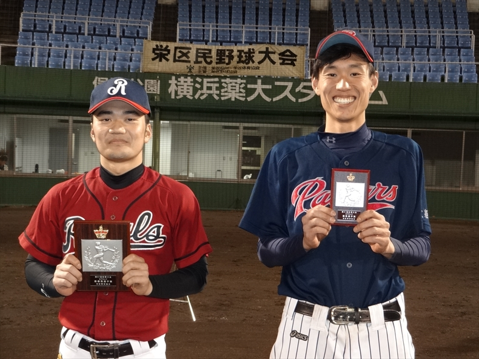

## Cブロック

- 優勝 横浜キングス
- 準優勝 ＲＯＯＫＩＥＳ

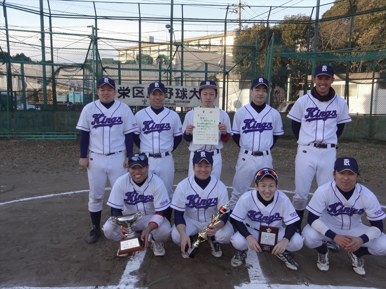

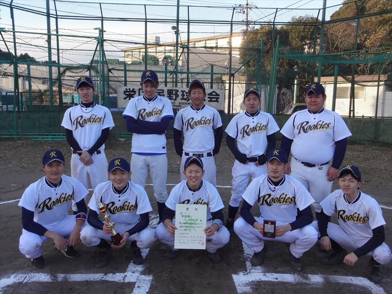

- 最優秀選手 横浜キングス　東風谷一樹選手
- 優秀選手 ＲＯＯＫＩＥＳ　北野太郎選手

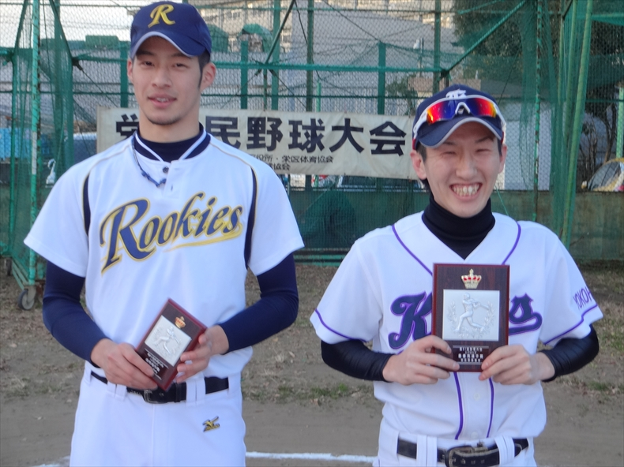

## Mブロック

- 優勝 ＬＵａＵかいぞく
- 準優勝 WinBacks LEGEND

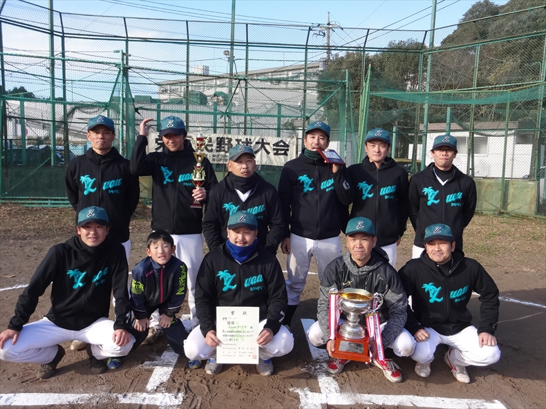

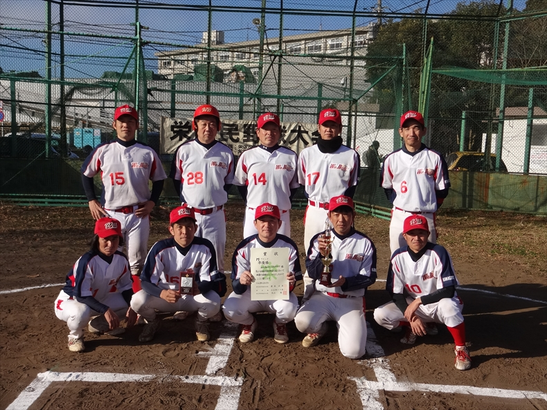

- 最優秀選手 ＬＵａＵかいぞく　村井祐介選手
- 優秀選手 ＷｉｎＢａｃｋｓ　ＬＥＧＥＮＤ　高橋洋成選手

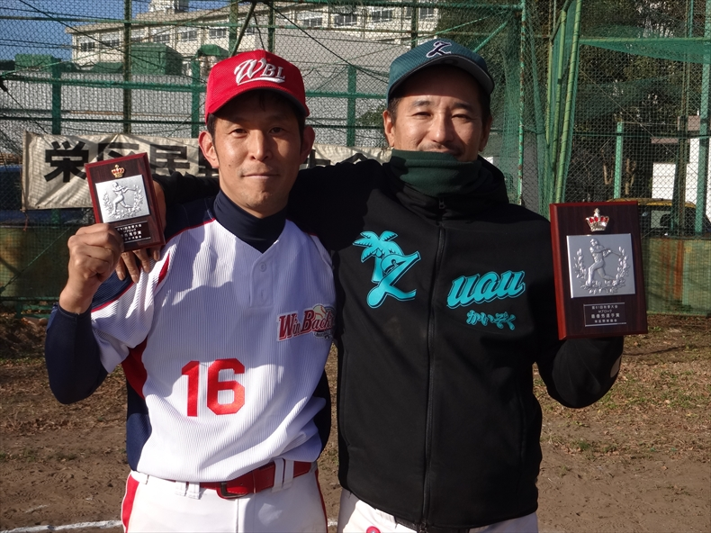
