# 第65回 栄区民野球大会

## Aブロック

- 優勝 Hard Boys
- 準優勝 パイヤーズ

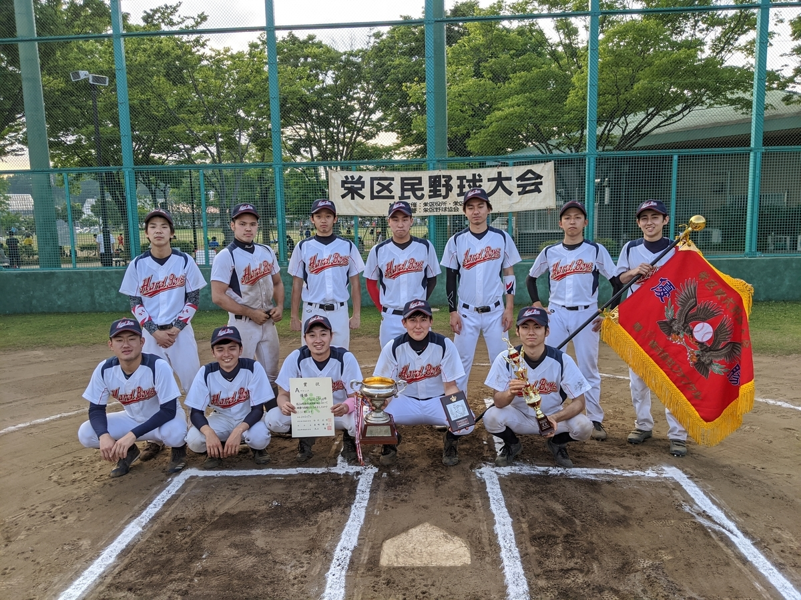

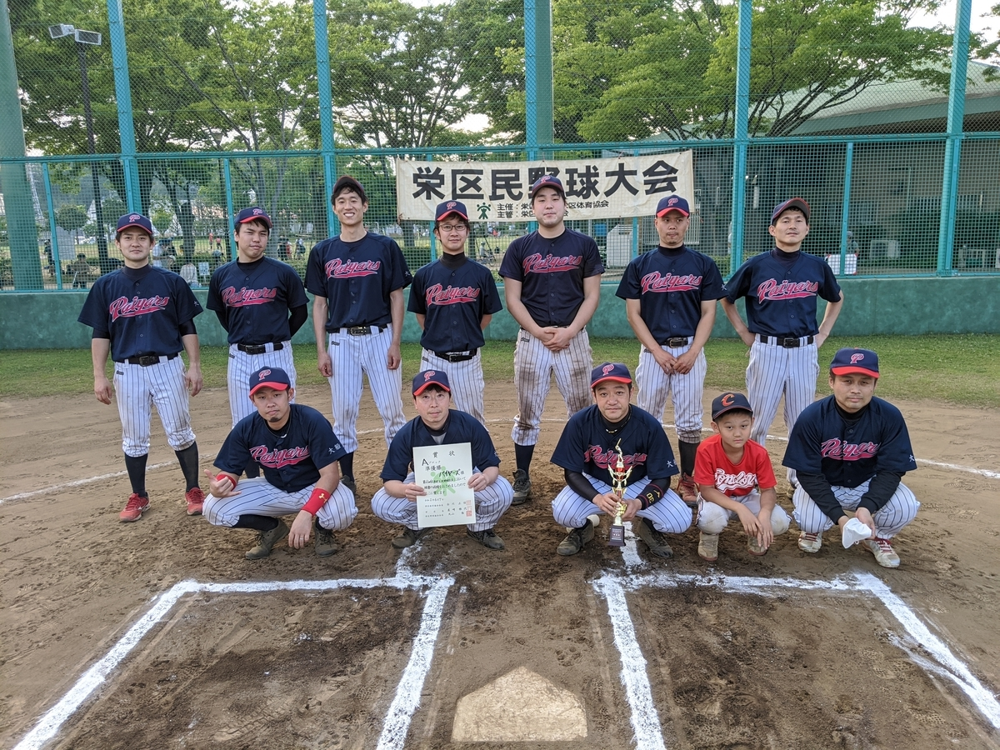

- 最優秀選手 Hard Boys　稲垣樹選手
- 優秀選手 パイヤーズ　足立翔真選手

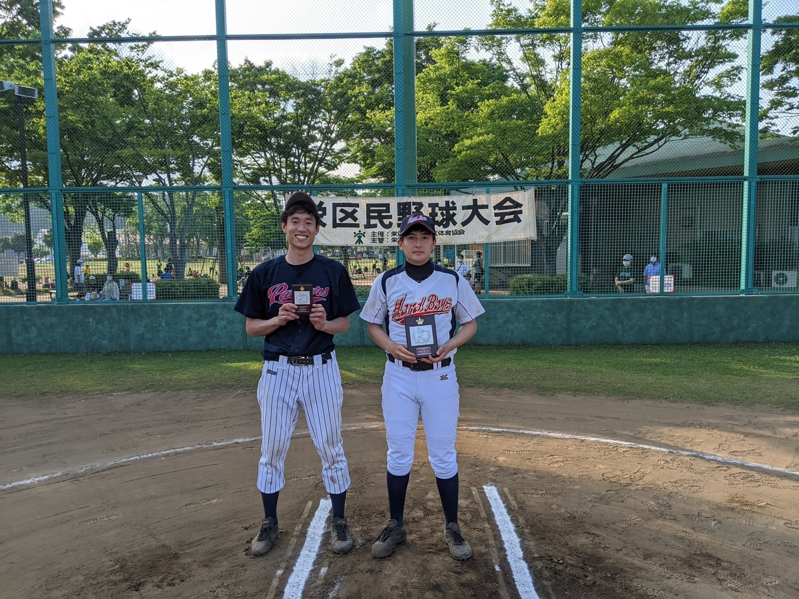

## Bブロック

- 優勝 ＺＥＲＯ
- 準優勝 ブライアンズ

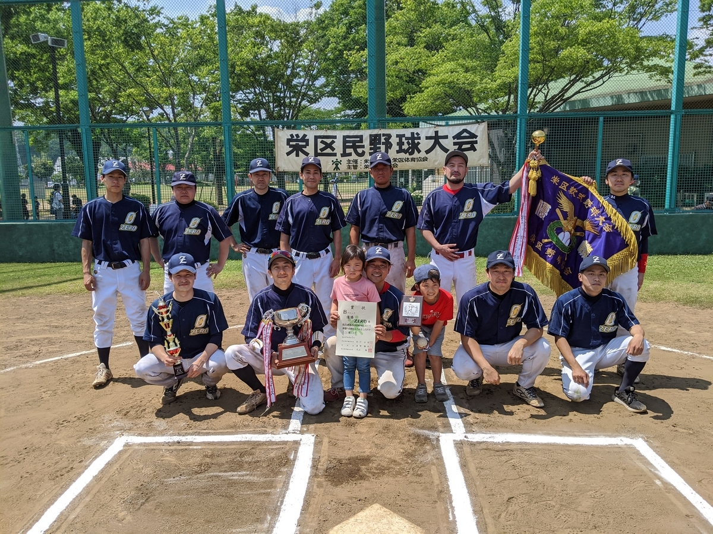

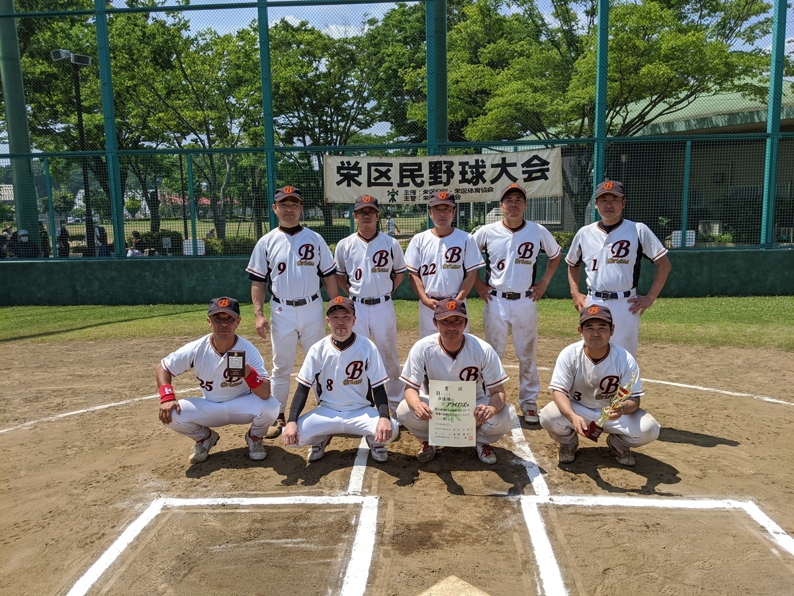

- 最優秀選手 ZERO　地引満選手
- 優秀選手 ブライアンズ　田崎健一選手

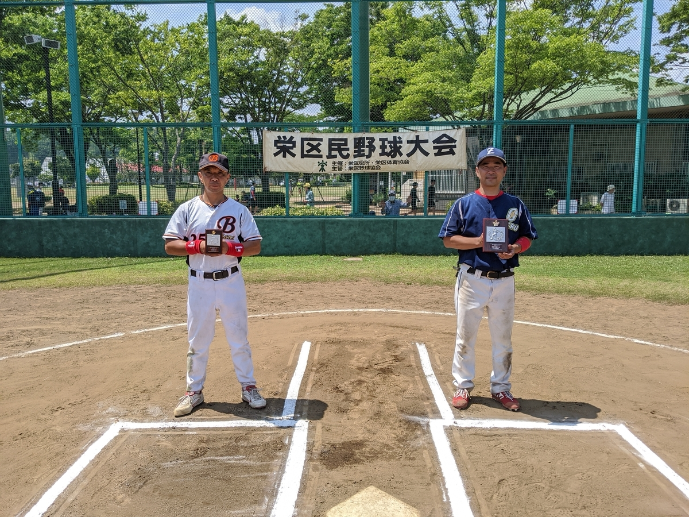

## Cブロック

- 優勝 REDWIMPS
- 準優勝 WinBacks

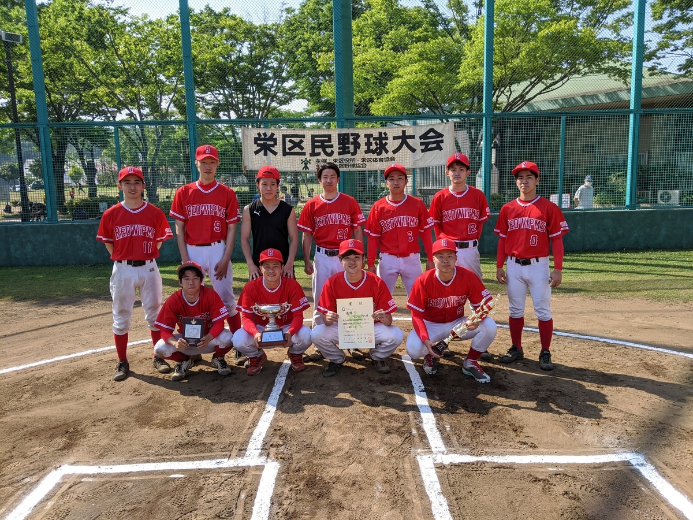

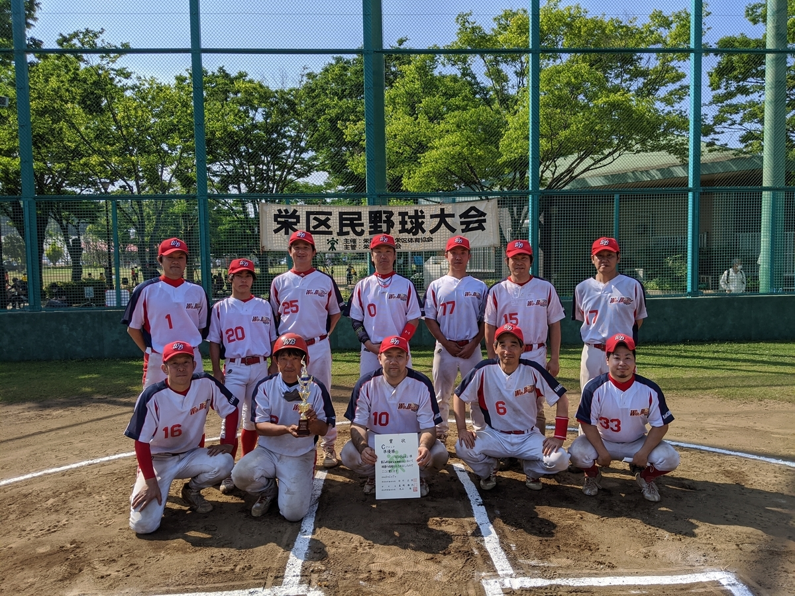

- 最優秀選手 REDWIMPS　花形亮選手
- 優秀選手 WinBacks　持田一彦選手

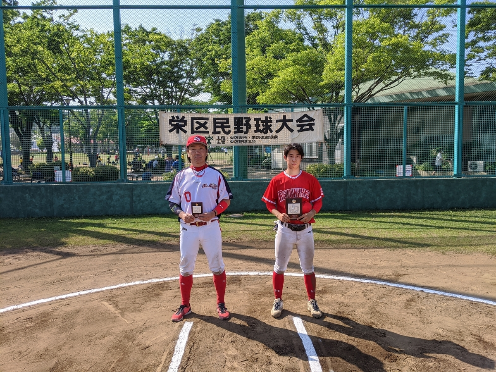

## Mブロック

- 優勝 かいぞく
- 準優勝 WinBacks LEGEND

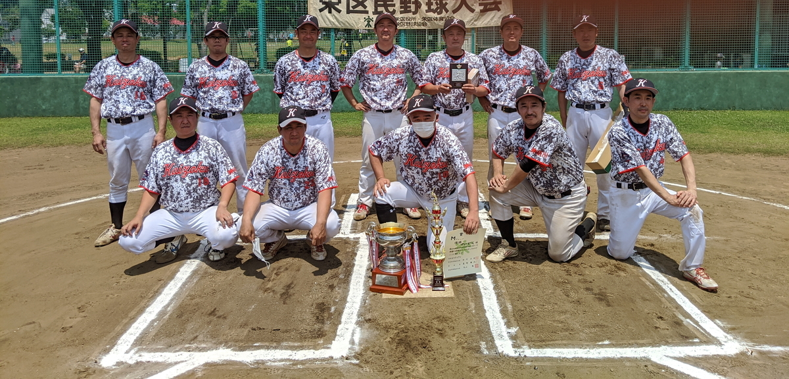

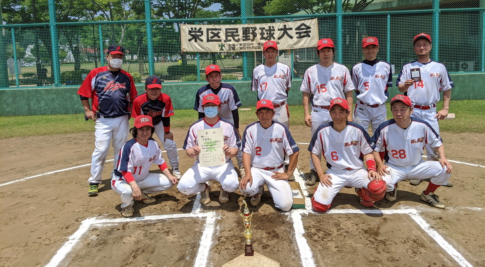

- 最優秀選手 かいぞく　斉田健二選手
- 優秀選手 WinBacks LEGEND　川崎周一選手

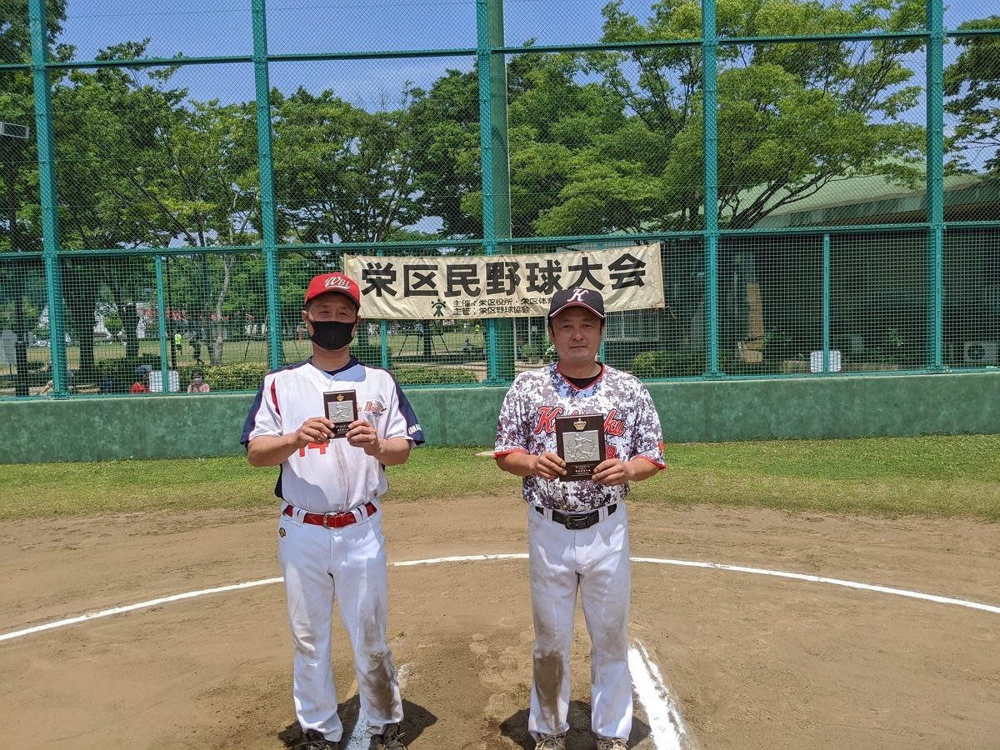
