# 第66回 栄区民野球大会

## Aブロック

- 優勝 KAIZOKU
- 準優勝 Hard Boys

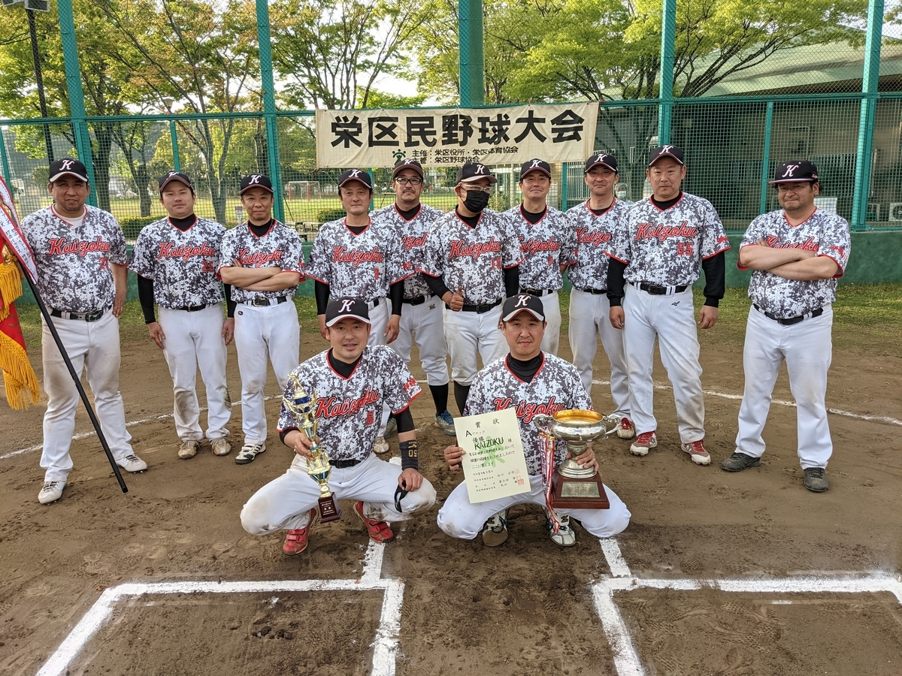

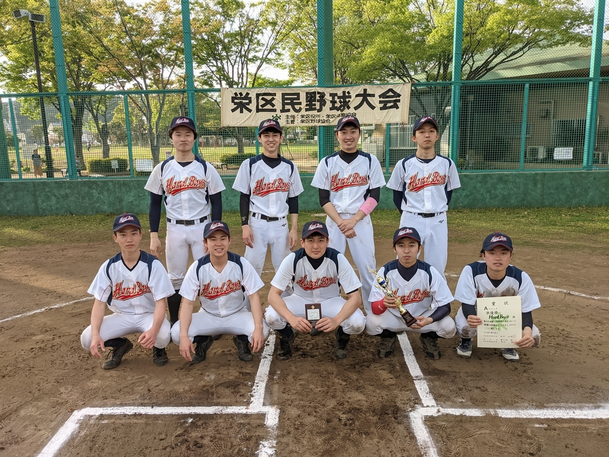

- 最優秀選手 KAIZOKU　浅羽賢一選手
- 優秀選手 Hard Boys　稲垣樹選手

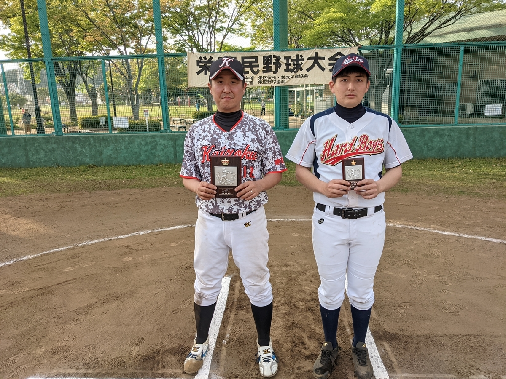

## Bブロック

- 優勝 バッカス
- 準優勝 横浜RedLob's

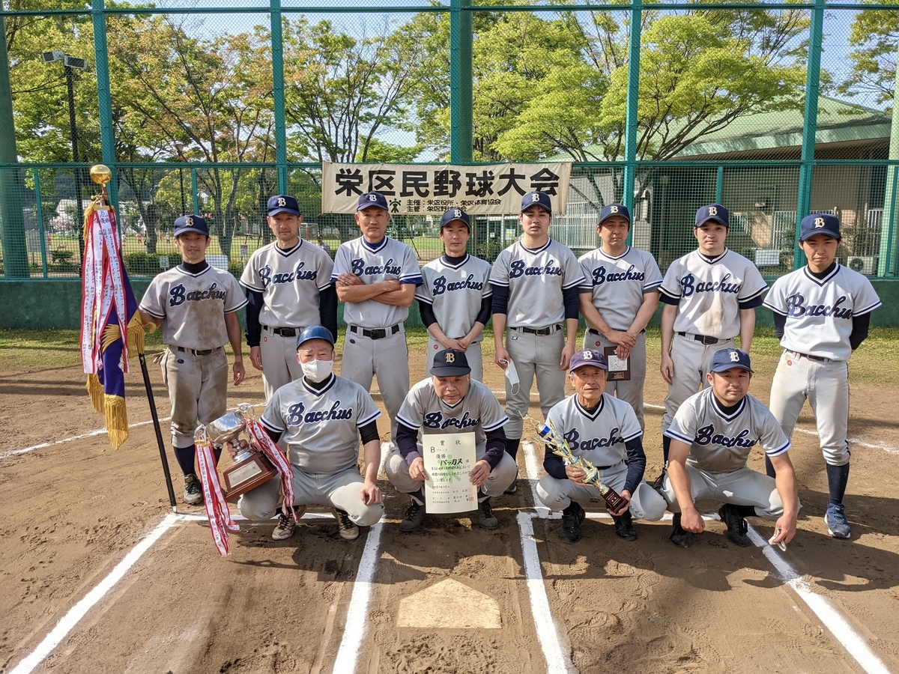

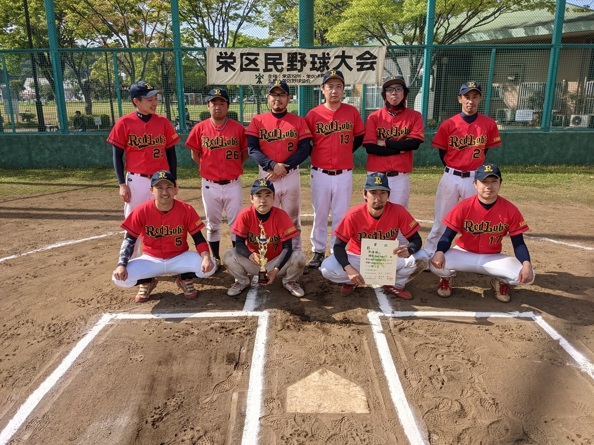

- 最優秀選手 バッカス　竹田津俊一選手
- 優秀選手 バッカス　岩本裕太選手

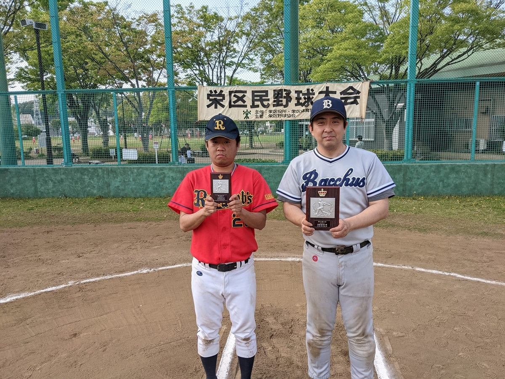

## Cブロック

- 優勝 SHIPS
- 準優勝 MIRACOLO

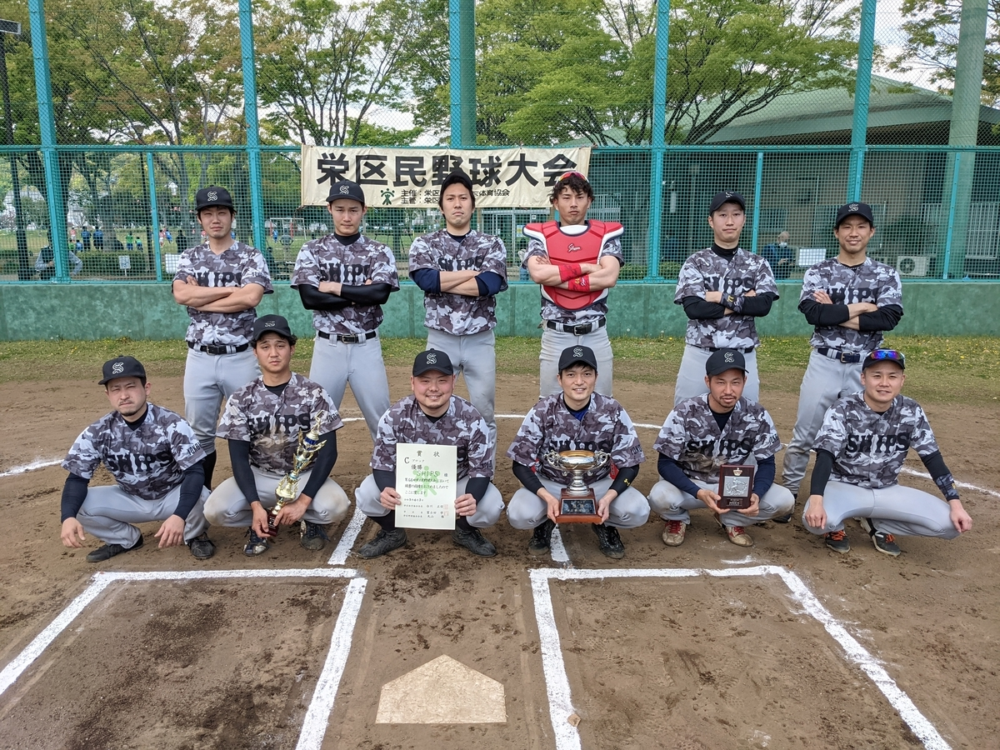

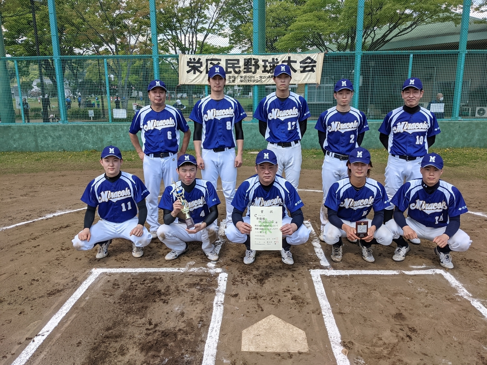

- 最優秀選手 SHIPS　大河原一晃選手
- 優秀選手 MIRACOLO　佐藤大亮選手

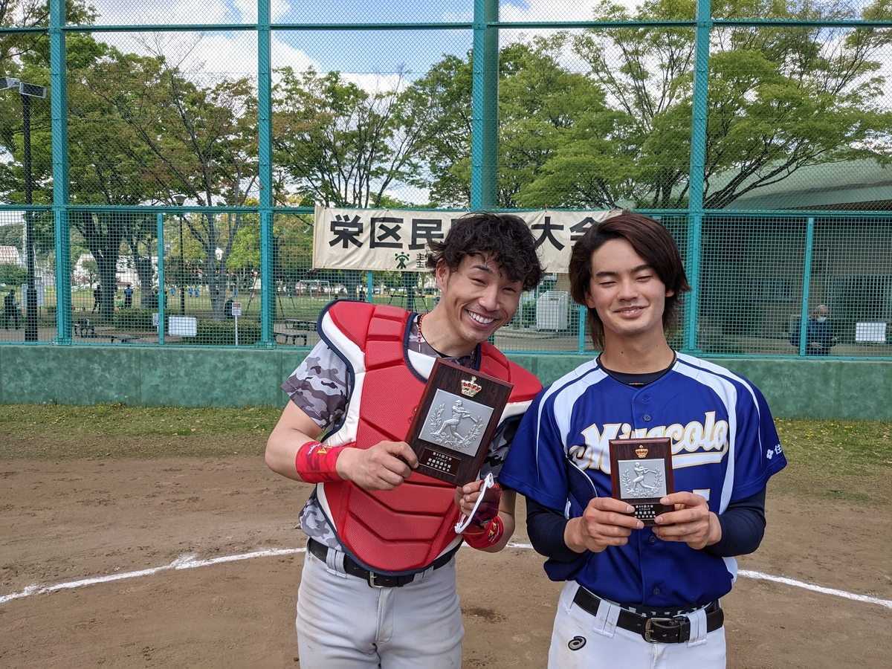

## Mブロック

- 優勝 WinBacks LEGEND
- 準優勝 かいぞく

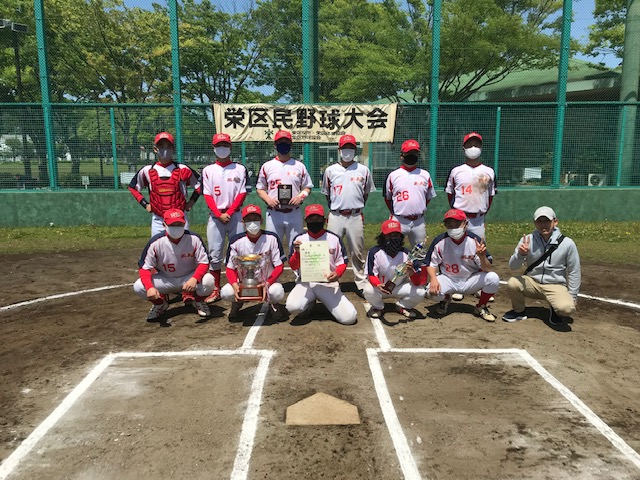

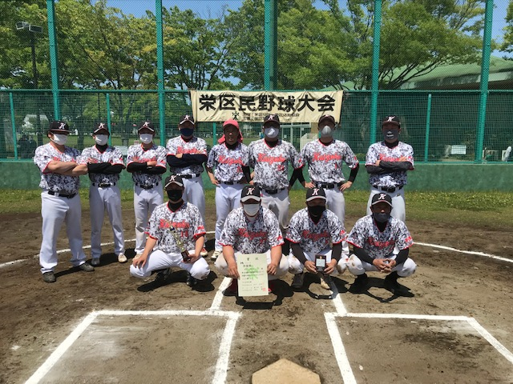

- 最優秀選手 WinBacks LEGEND　阿部純也選手
- 優秀選手 かいぞく　福田博史選手

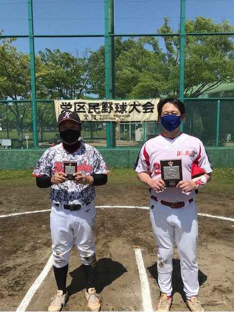
