# 第67回 栄区民野球大会

## Aブロック

- 優勝 横浜ドンタコス
- 準優勝 KAIZOKU

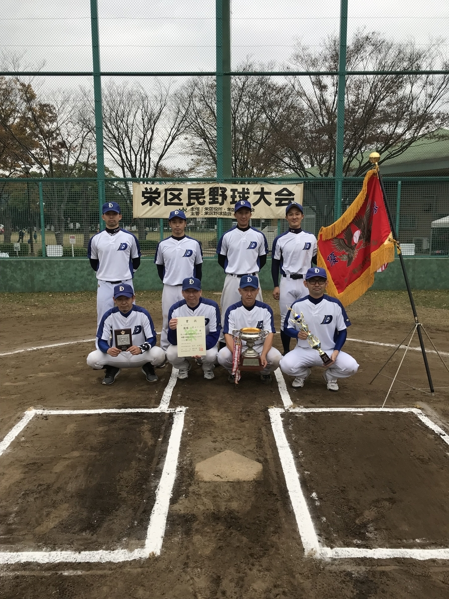

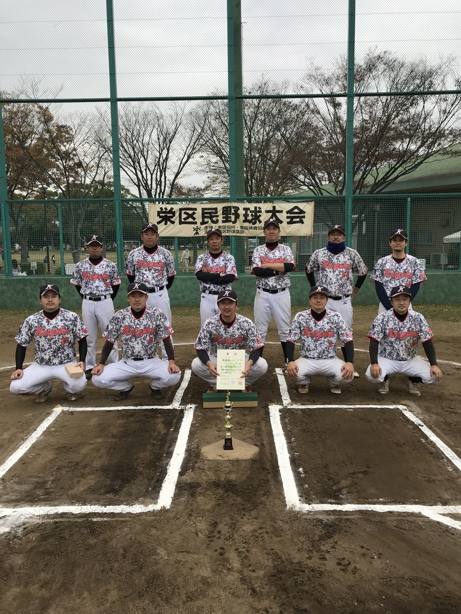

- 最優秀選手 横浜ドンタコス　橋本尚吾選手
- 優秀選手 横浜ドンタコス　高田一也選手

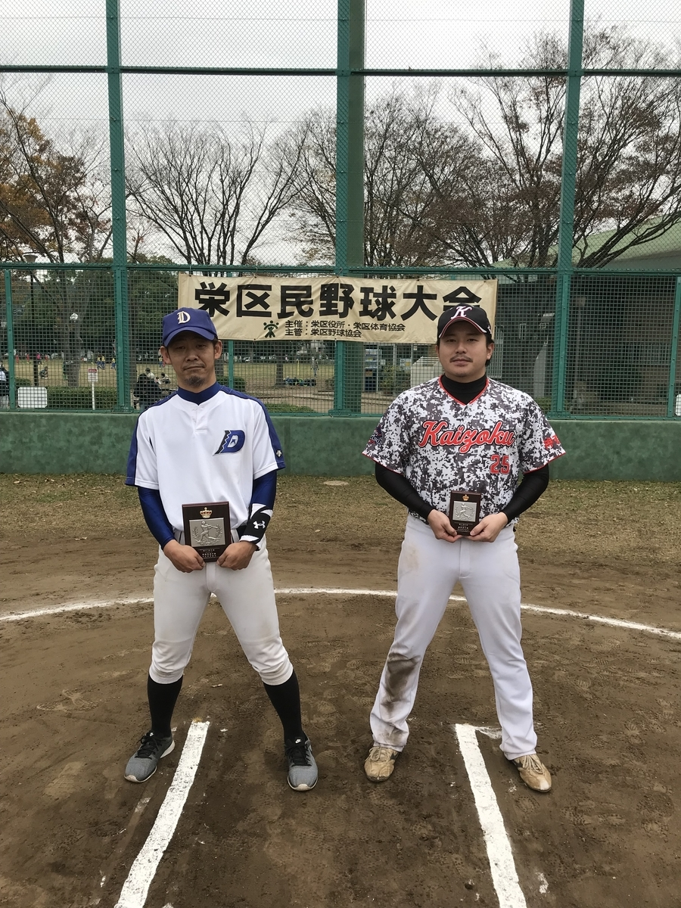

## Bブロック

- 優勝 SHIPS
- 準優勝 MIRACOLO

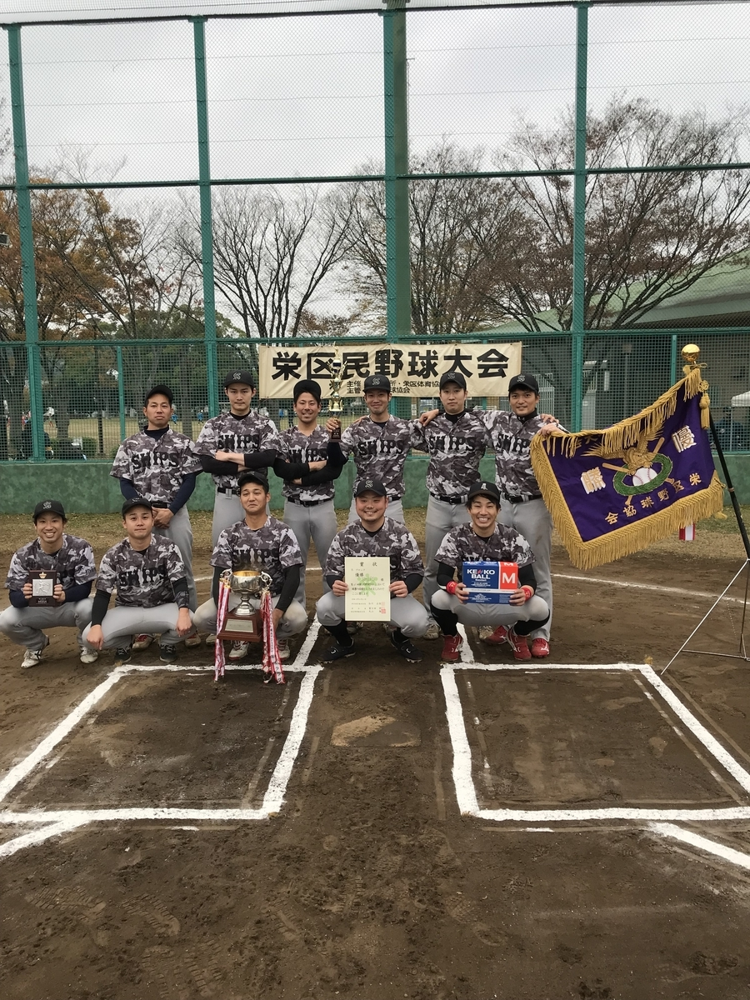

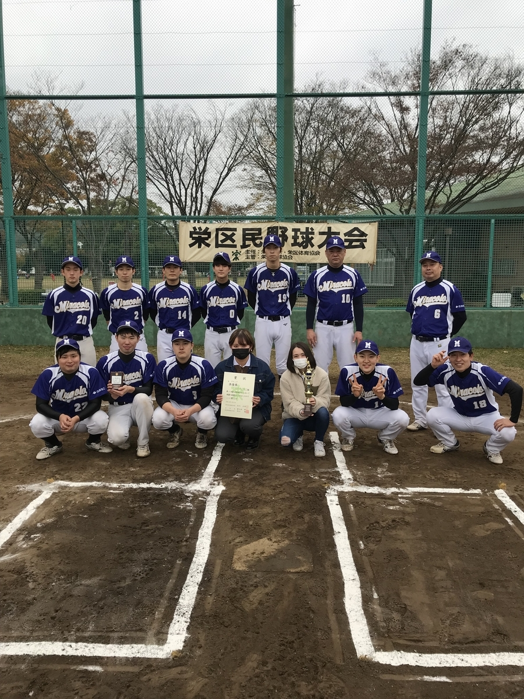

- 最優秀選手 SHIPS　大久保裕貴選手
- 優秀選手 SHIPS　武田朋也選手

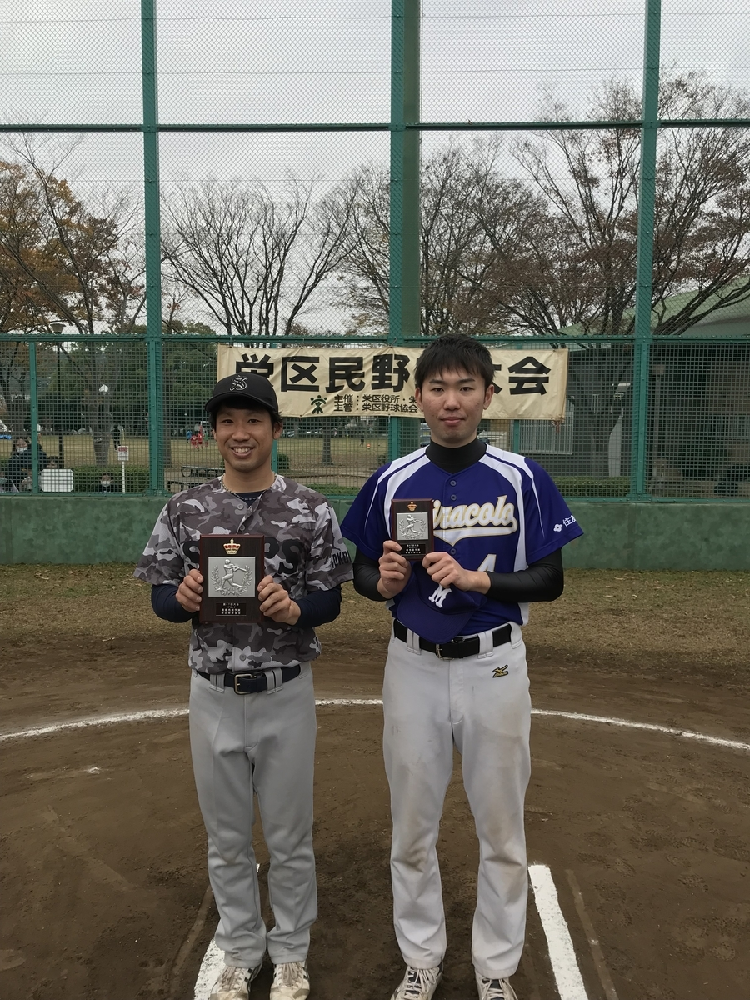

## Cブロック

- 優勝 DODGE
- 準優勝 ジェミニ

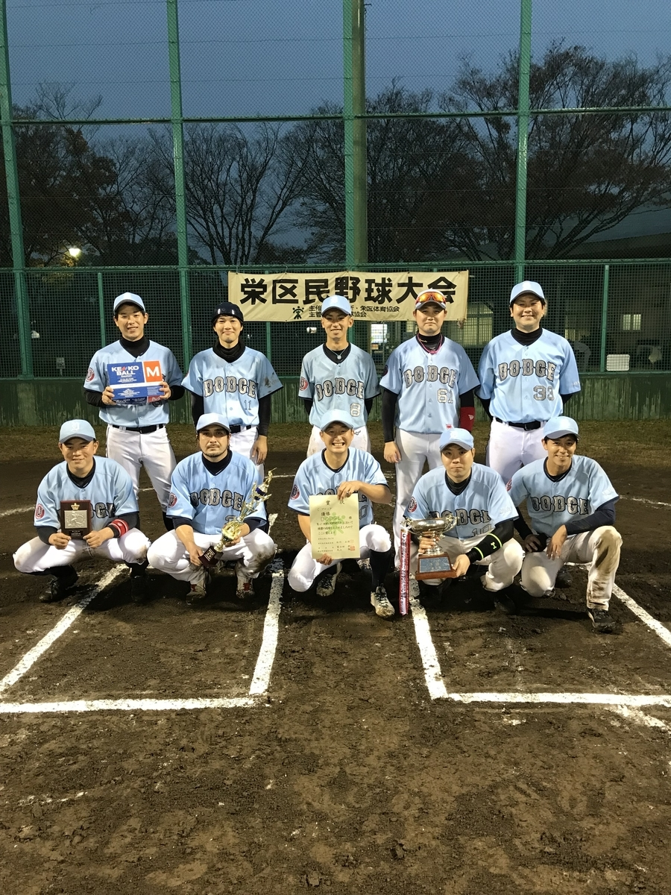

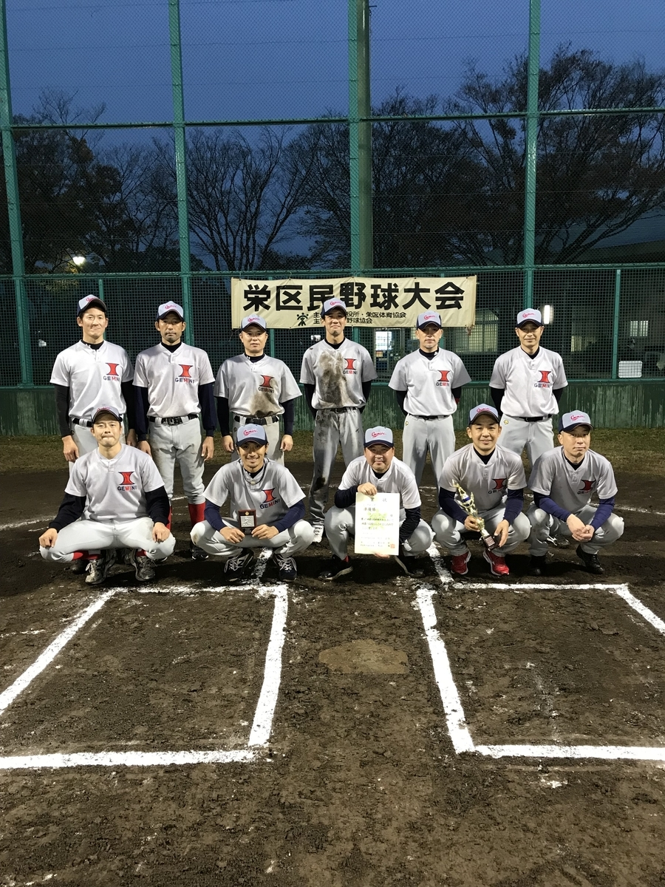

- 最優秀選手 DODGE　大村龍雅選手
- 優秀選手 DODGE　石沢直之選手

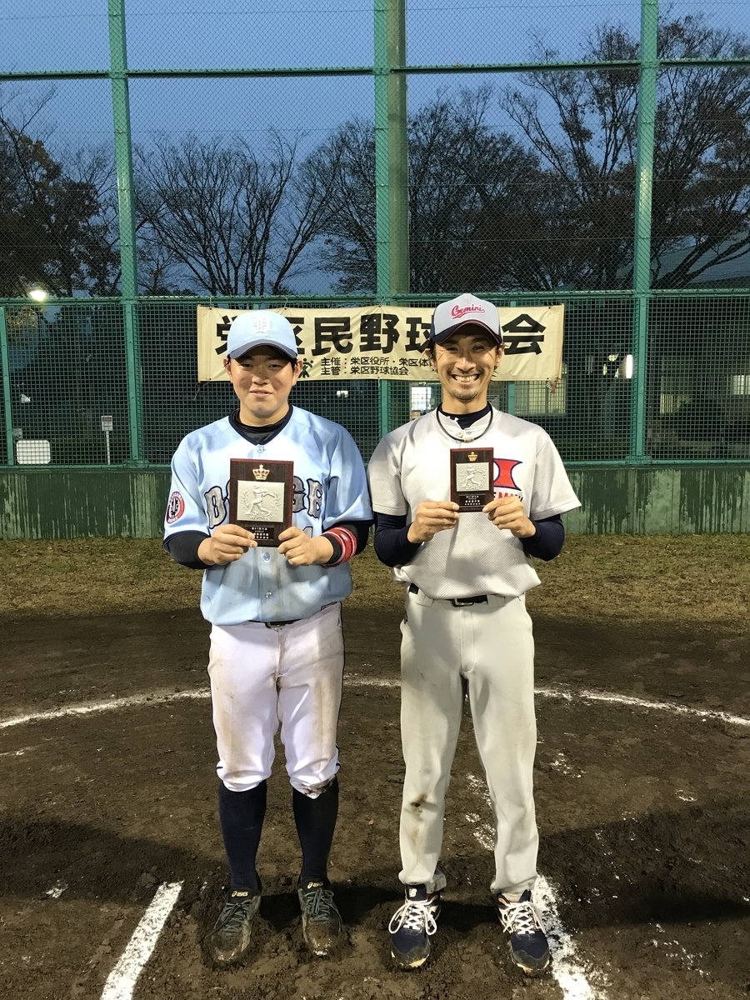

## Mブロック

- 優勝 かいぞく
- 準優勝 石川歯科

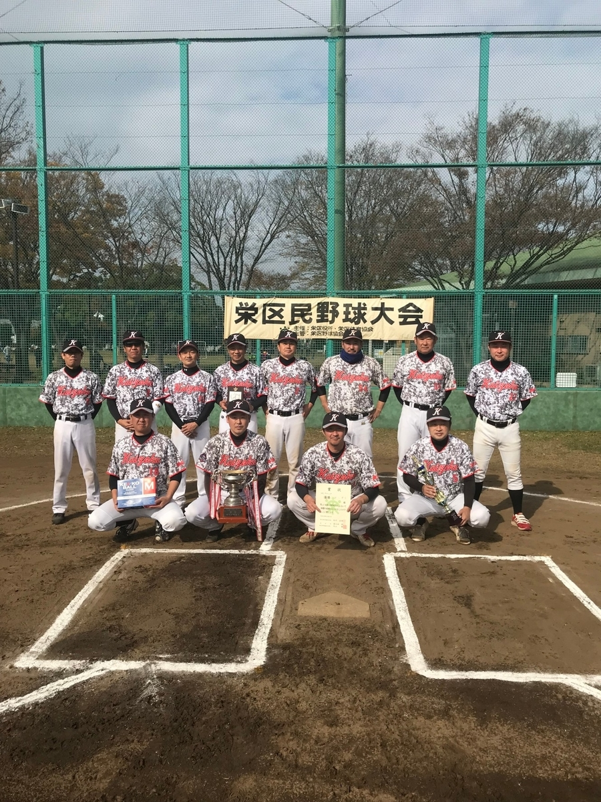

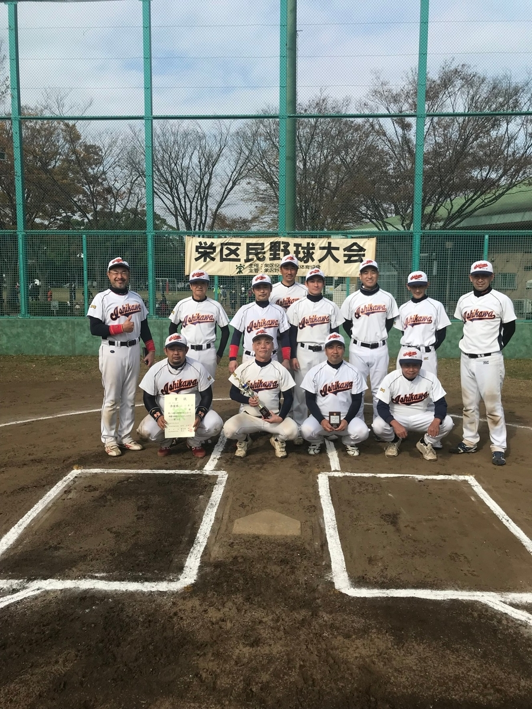

- 最優秀選手 かいぞく　斉藤邦夫選手
- 優秀選手 かいぞく　清水隆之選手

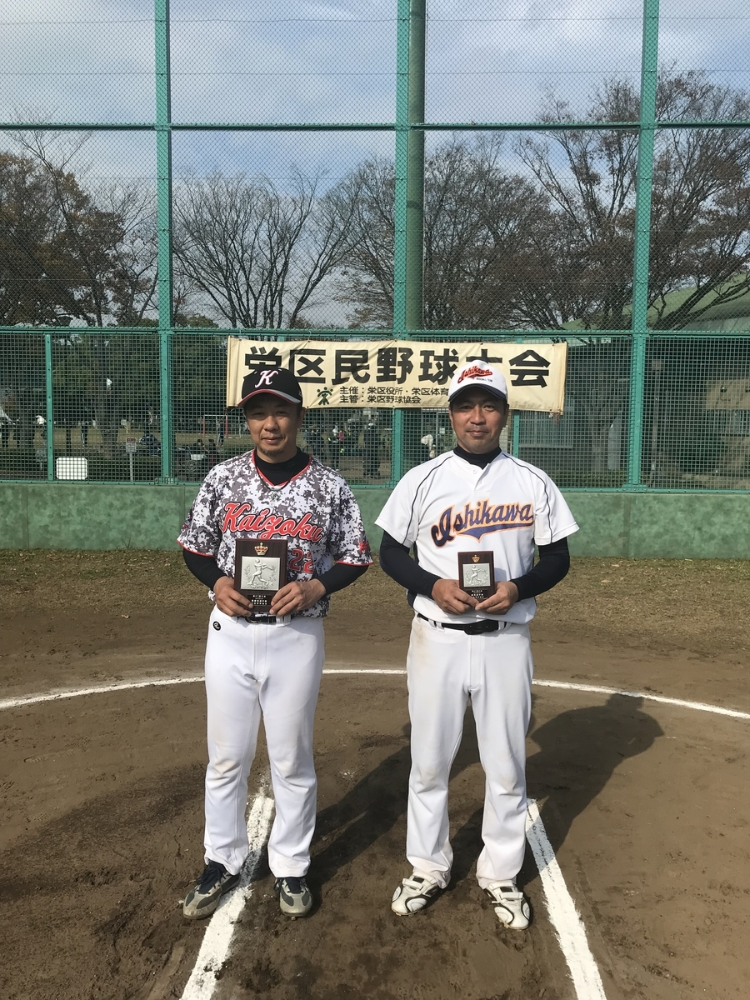
