# 第70回 栄区民野球大会

## Aブロック

- 優勝 Ｈａｒｄ Ｂｏｙｓ
- 準優勝 ＳＨＩＰＳ

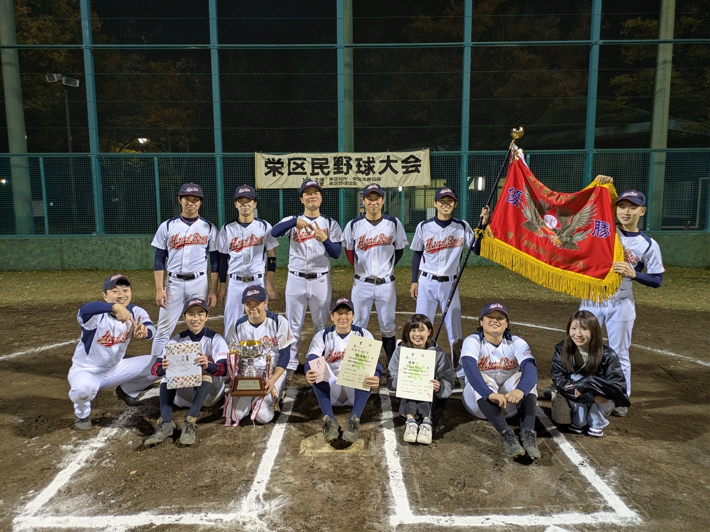

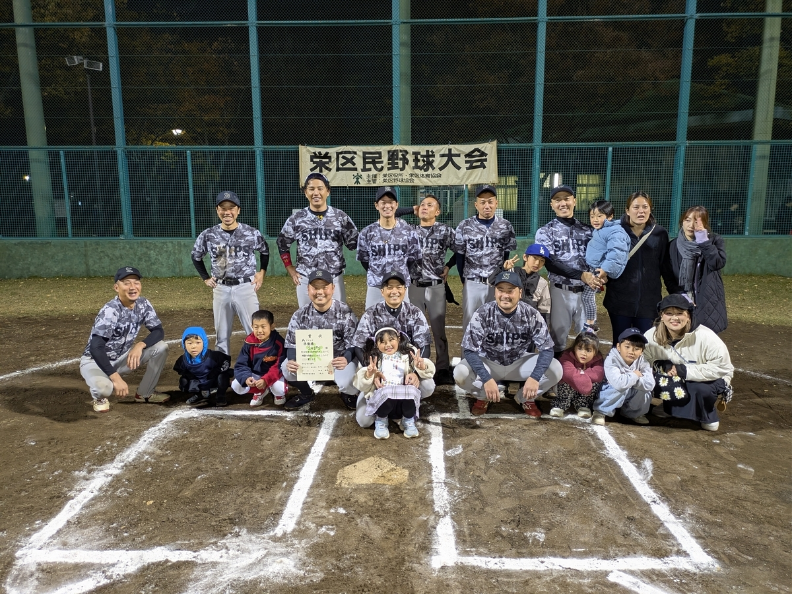

- 最優秀選手 稲垣樹選手
- 優秀選手 清水雄太選手

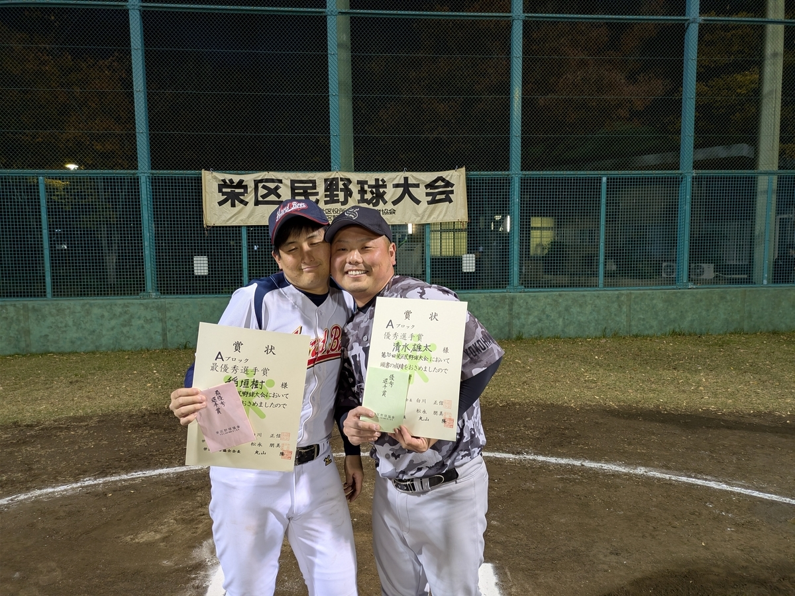

## Bブロック

- 優勝 パイヤーズ
- 準優勝 ＺＥＲＯ

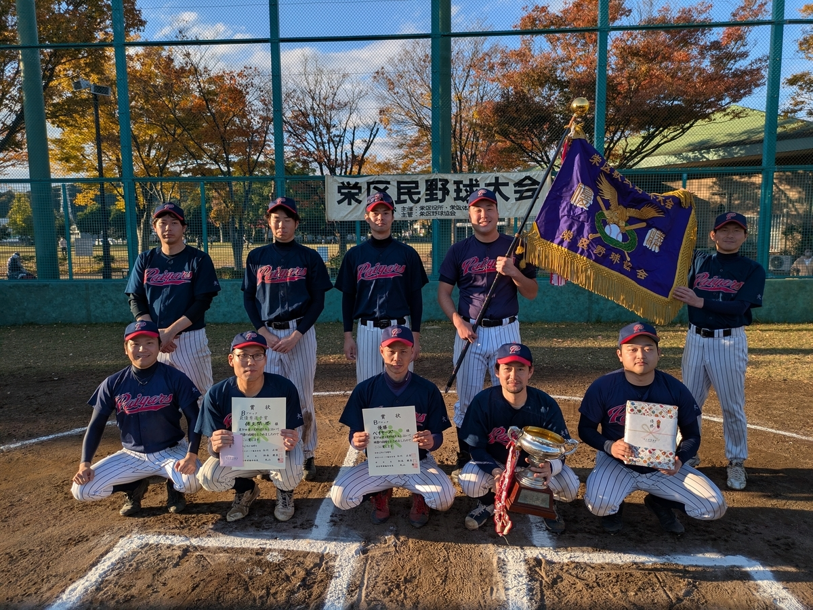

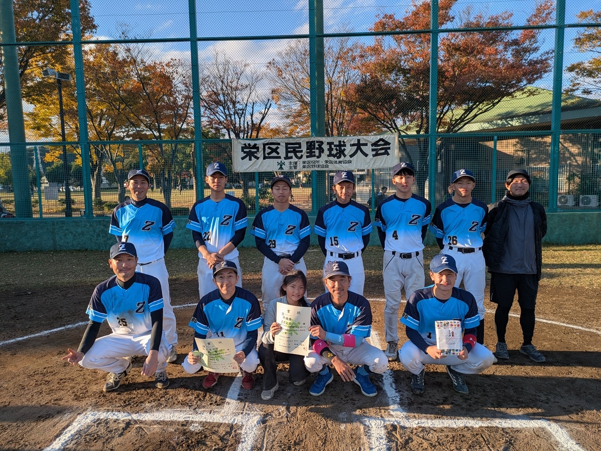

- 最優秀選手 佐久間啓選手
- 優秀選手 森聖俊選手

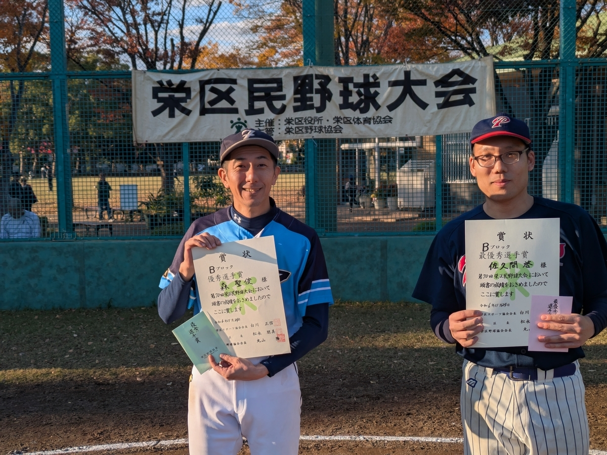

## Cブロック

- 優勝 ナンバレッズ
- 準優勝 豊田パークス

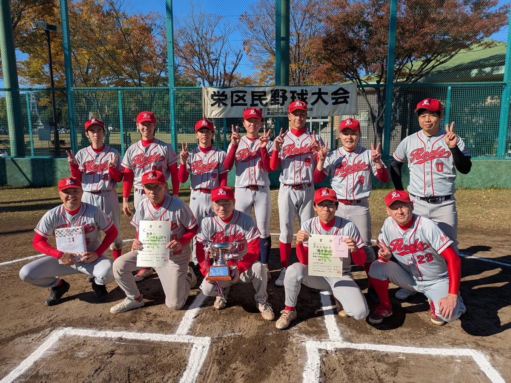

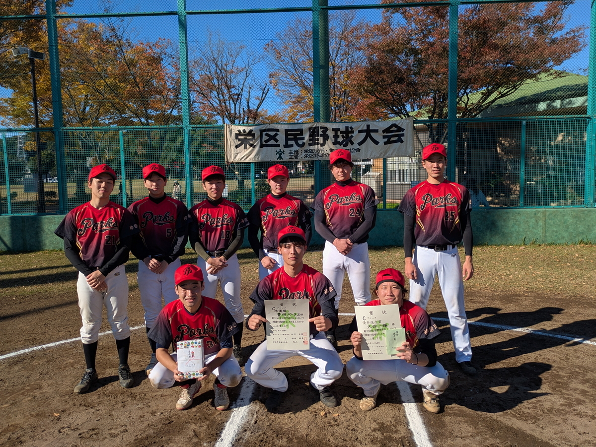

- 最優秀選手 酒井能武与選手
- 優秀選手 大西一輝選手

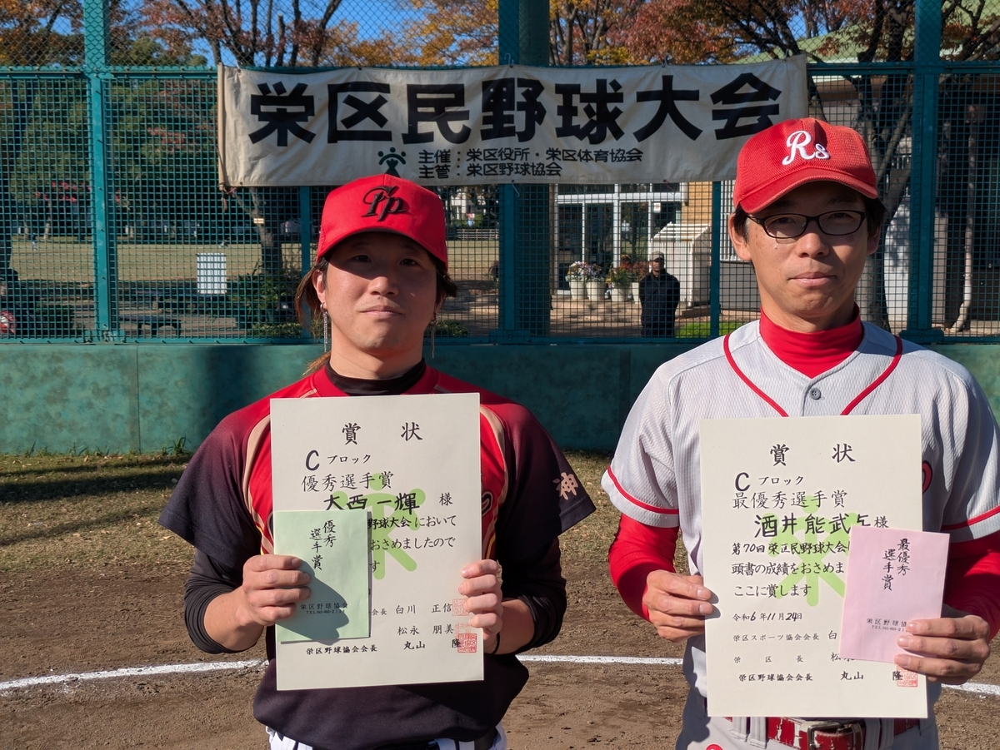

## Mブロック

- 優勝 バッカス
- 準優勝 WinBacks LEGEND

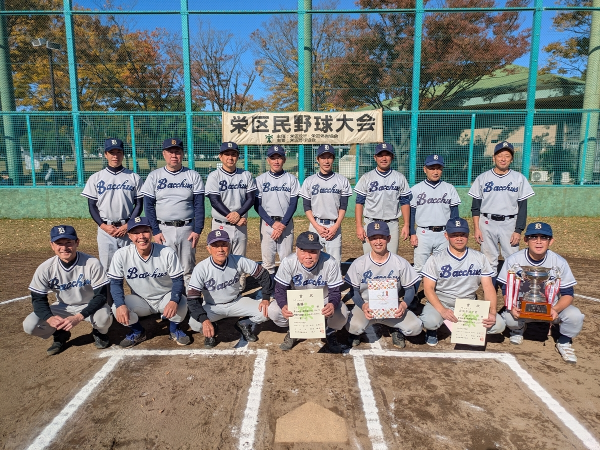

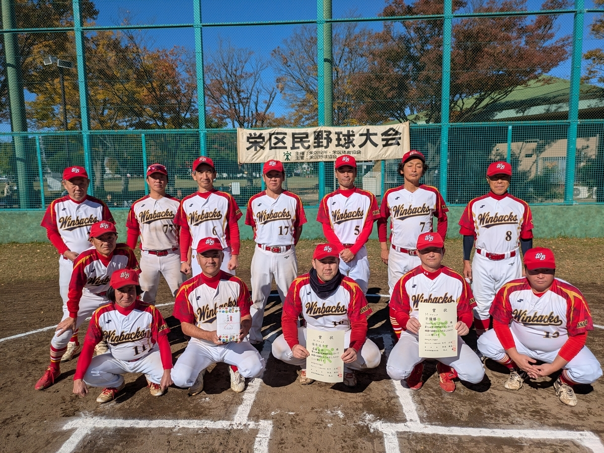

- 最優秀選手 上床健太選手
- 優秀選手 遠藤勇樹選手

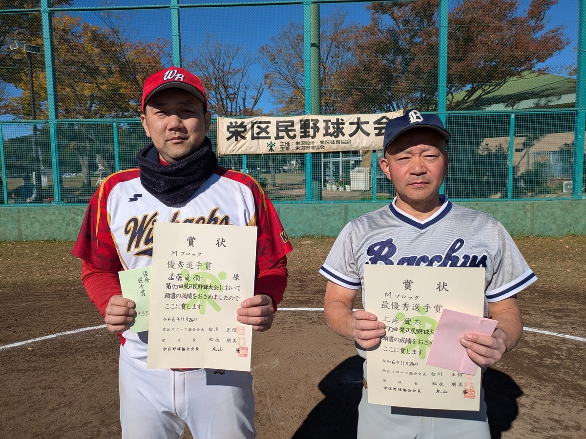
