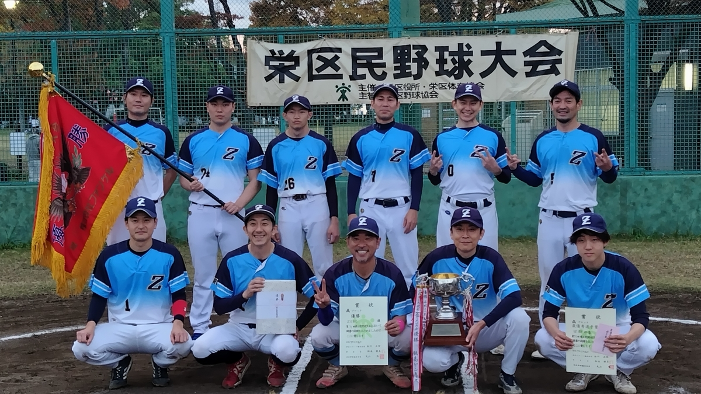
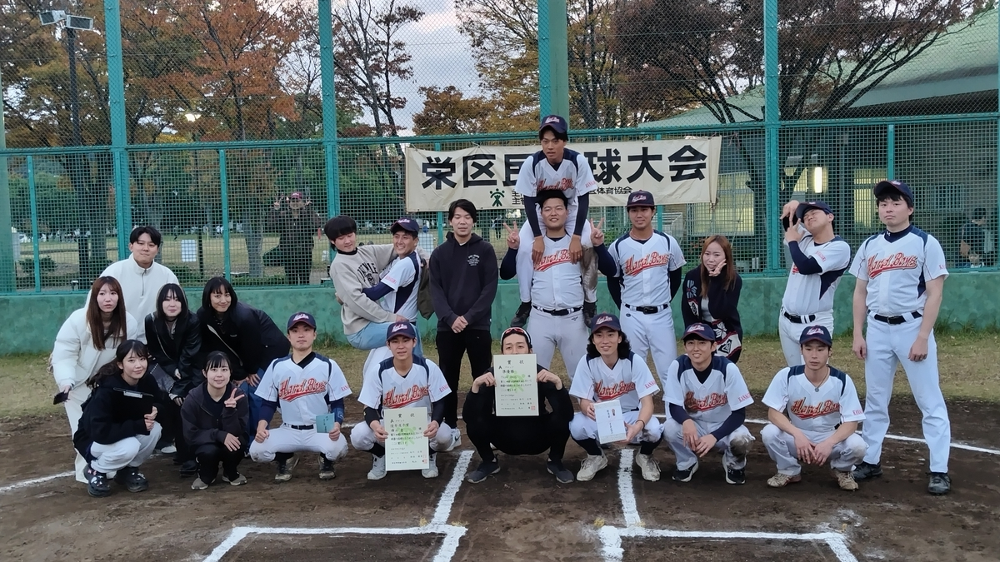
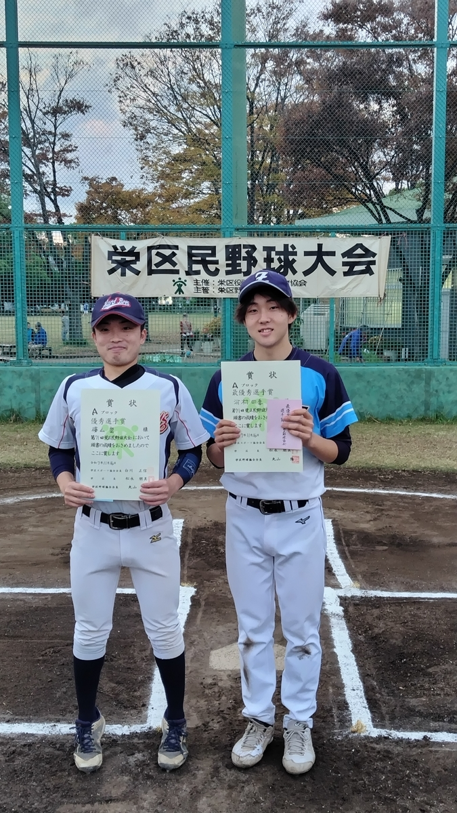
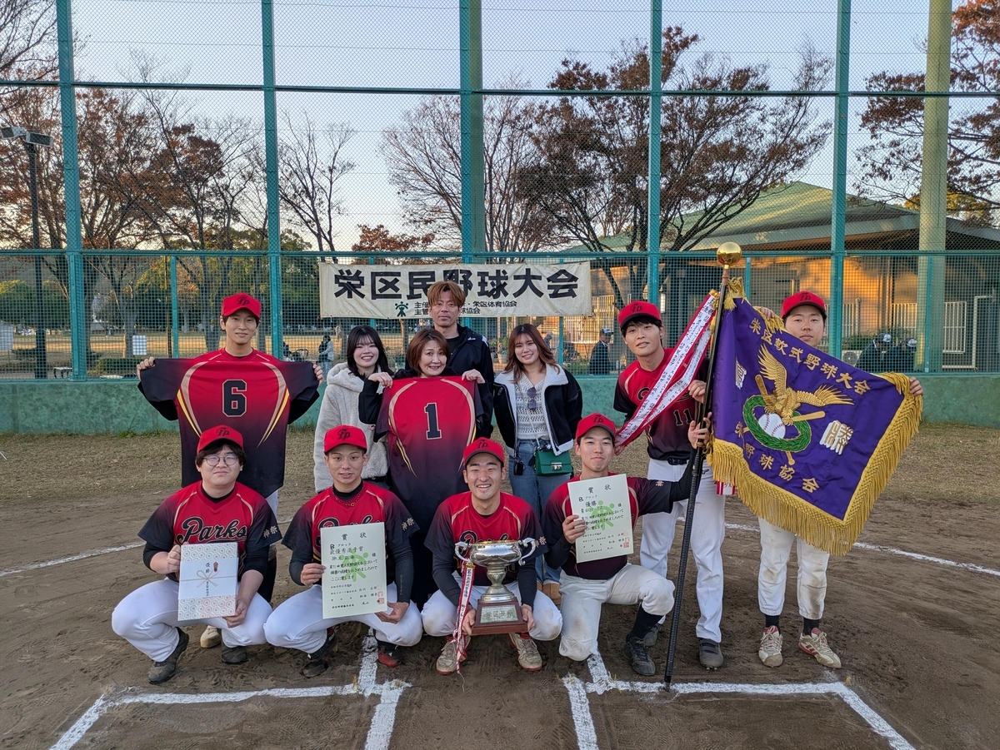
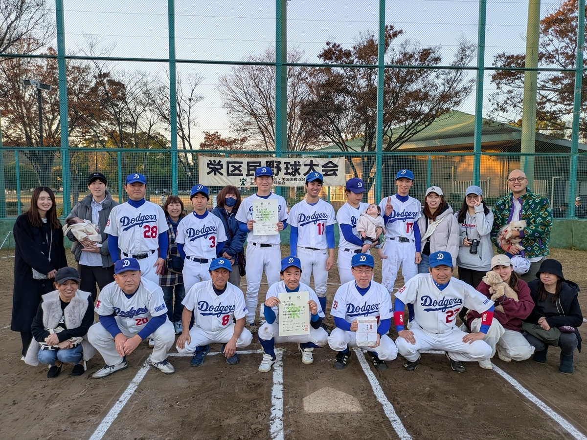
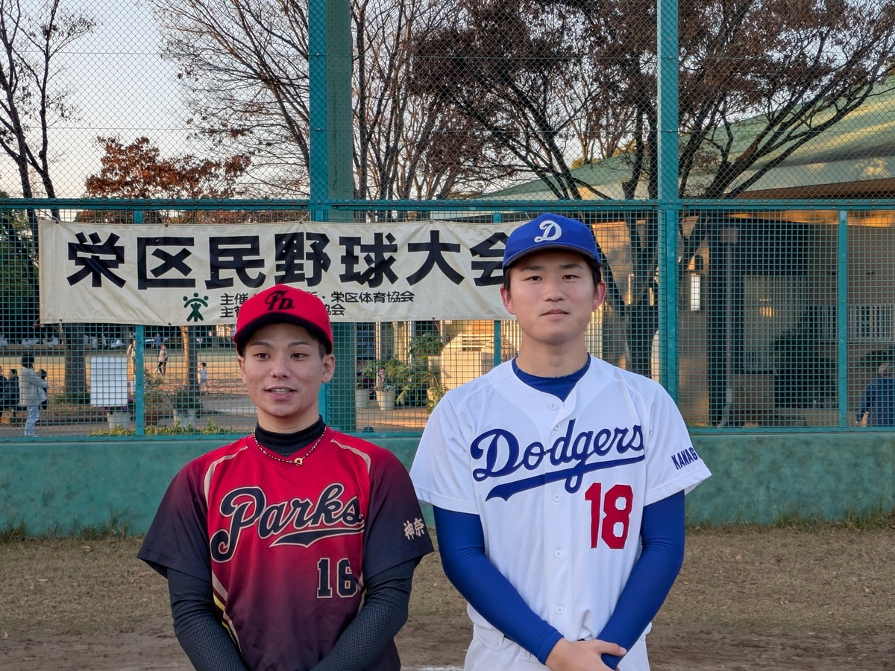

# 第71回 栄区民野球大会

## Aブロック

- 優勝 ZERO
- 準優勝 Ｈａｒｄ Ｂｏｙｓ

- 最優秀選手  河村四季選手
- 優秀選手 横山希望選手

## Bブロック

- 優勝 豊田パークス
- 準優勝 ドジャース

- 最優秀選手 柿木拓海選手
- 優秀選手 佐藤大吾選手

## Cブロック

- 最優秀選手: 大佐和佑樹選手
- 優秀選手: 切明畑尚也選手

- 最優秀選手 柿木拓海選手
- 優秀選手 佐藤大吾選手

## Mブロック

- 優勝:かいぞく
- 準優勝: 横浜コミカルズ

- 最優秀選手: 斉藤邦夫選手
- 優秀選手: 笠繁和選手

